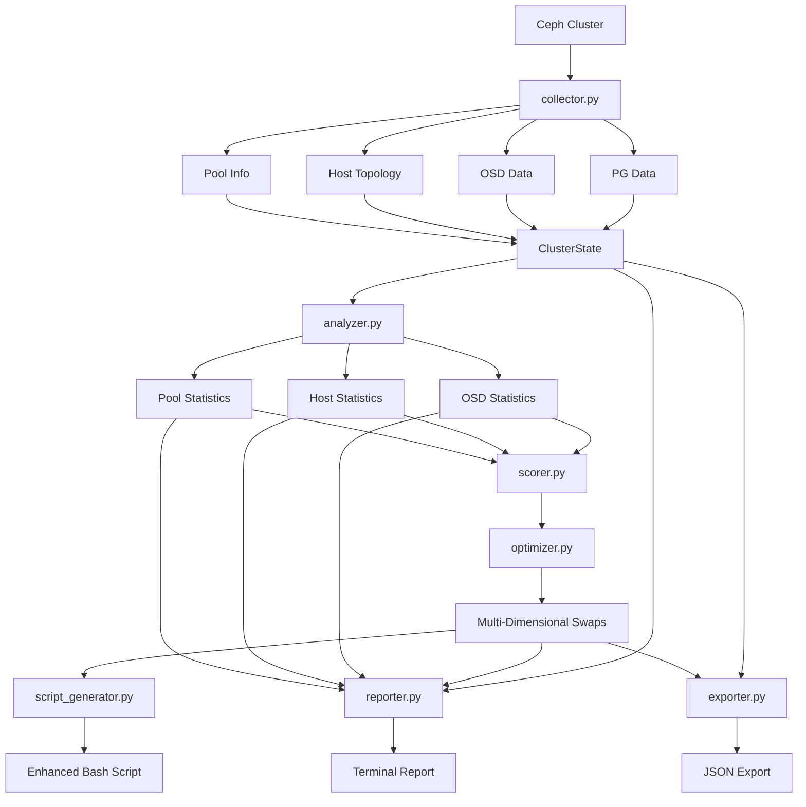

# Ceph Primary Balancer - Completion Roadmap to v2.0

## Document Overview

**Date:** 2026-02-03  
**Current Version:** MVP v1.0 (OSD-level balancing)  
**Target Version:** v2.0 (Full multi-dimensional balancing)  
**Completion Status:** ~40% complete (MVP done, 60% remaining)

---

## 1. Executive Summary

### Current State

The Ceph Primary Balancer MVP is **100% complete** and production-ready for OSD-level primary balancing. The current implementation includes:

✅ **Completed Features:**
- Data collection from Ceph cluster via CLI ([`collector.py`](../src/ceph_primary_balancer/collector.py))
- OSD-level statistical analysis ([`analyzer.py`](../src/ceph_primary_balancer/analyzer.py))
- Greedy optimization algorithm for variance reduction ([`optimizer.py`](../src/ceph_primary_balancer/optimizer.py))
- Bash script generation with `pg-upmap-primary` commands ([`script_generator.py`](../src/ceph_primary_balancer/script_generator.py))
- Basic CLI interface with `--dry-run` and `--target-cv` options ([`cli.py`](../src/ceph_primary_balancer/cli.py))
- Core data models ([`models.py`](../src/ceph_primary_balancer/models.py))
- Integration testing with fixtures

**Current Capabilities:**
- Analyzes primary distribution across OSDs
- Reduces OSD-level coefficient of variation (CV) from 30-50% to <10%
- Generates executable rebalancing scripts
- Zero data movement (metadata-only operations)

### Gap Analysis Summary

According to the full [technical specification](../docs/technical-specification.md), we are missing **~60% of planned functionality**:

❌ **Missing Critical Features:**
1. **Host-level optimization** - Prevents network/node bottlenecks (not implemented)
2. **Pool-level optimization** - Per-pool balance for workload-specific needs (not implemented)
3. **Multi-dimensional scoring** - Weighted composite score balancing all three dimensions (uses simple variance)
4. **JSON export** - Machine-readable output for automation (terminal output only)
5. **Comprehensive reporting** - Detailed statistics with host/pool breakdowns (basic stats only)
6. **Advanced CLI options** - `--max-changes`, `--output-dir`, weight configuration (minimal flags)
7. **Enhanced script generation** - Health checks, pool organization, rollback capability (basic script)
8. **Comprehensive test suite** - Unit tests for all components (integration test only)

### Completion Goals

The v2.0 release will deliver the full specification across **4 phases**, achieving:

🎯 **v2.0 Success Criteria:**
- Multi-dimensional balancing: OSD + Host + Pool levels simultaneously
- Host-level CV < 5% (in addition to OSD-level CV < 10%)
- Per-pool balancing with individual CV targets
- JSON export with comprehensive statistics and automation-ready format
- Enhanced reporting with before/after comparisons at all levels
- Advanced CLI with full configurability
- Production-grade script generation with safety checks
- 80%+ test coverage with unit, integration, and end-to-end tests

---

## 2. Phase Breakdown

### Phase 1: Host-Level Balancing (Priority 1A)

**Objective:** Add host-aware optimization to prevent network/node hotspots

**Duration Estimate:** Mid-complexity phase  
**Completion Target:** Increases project completion to ~55%

#### Deliverables

1. **Enhanced Data Models** (~30 lines)
   - Add `HostInfo` dataclass to [`models.py`](../src/ceph_primary_balancer/models.py)
   - Extend `ClusterState` to include host topology
   - Update `SwapProposal` to track host-level impact

2. **Host Topology Collection** (~60 lines)
   - Enhance [`collector.py`](../src/ceph_primary_balancer/collector.py) to parse host hierarchy from `ceph osd tree`
   - Build OSD-to-host mapping
   - Calculate primary counts per host

3. **Host-Level Analysis** (~80 lines)
   - Add host statistics calculation to [`analyzer.py`](../src/ceph_primary_balancer/analyzer.py)
   - Identify donor/receiver hosts
   - Enhanced summary output with host-level metrics

4. **Two-Dimensional Scoring** (~100 lines)
   - Create new `scorer.py` module for multi-dimensional scoring
   - Implement composite score: `score = (w_osd × OSD_variance) + (w_host × Host_variance)`
   - Default weights: 60% OSD, 40% Host

5. **Host-Aware Optimization** (~80 lines)
   - Modify [`optimizer.py`](../src/ceph_primary_balancer/optimizer.py) to use composite scoring
   - Prioritize swaps that improve both OSD and host balance
   - Reject swaps that significantly worsen host balance

#### Key Implementation Details

**New Data Model:**
```python
@dataclass
class HostInfo:
    """Host-level statistics for primary distribution."""
    hostname: str
    osd_ids: List[int]              # OSDs on this host
    primary_count: int = 0          # Total primaries across all OSDs
    target_primaries: int = 0       # Ideal primary count for this host
```

**Enhanced ClusterState:**
```python
@dataclass
class ClusterState:
    pgs: Dict[str, PGInfo]
    osds: Dict[int, OSDInfo]
    hosts: Dict[str, HostInfo]      # NEW: host topology
    osd_to_host: Dict[int, str]     # NEW: quick lookup
```

**Scoring Function:**
```python
# In new scorer.py module
class Scorer:
    def __init__(self, w_osd: float = 0.6, w_host: float = 0.4):
        self.w_osd = w_osd
        self.w_host = w_host
    
    def calculate_score(self, state: ClusterState) -> float:
        """Lower score = better balance."""
        osd_variance = calculate_osd_variance(state.osds)
        host_variance = calculate_host_variance(state.hosts)
        return (self.w_osd * osd_variance) + (self.w_host * host_variance)
```

#### Testing Requirements

- Unit tests for host statistics calculation
- Unit tests for two-dimensional scoring
- Integration test with mock data showing host-aware optimization
- Validation: Host CV < 5% after optimization

---

### Phase 2: Pool-Level Balancing (Priority 1B)

**Objective:** Enable per-pool optimization for workload-specific balance requirements

**Duration Estimate:** Mid-high complexity phase  
**Completion Target:** Increases project completion to ~70%

#### Deliverables

1. **Pool Data Models** (~40 lines)
   - Add `PoolInfo` dataclass to [`models.py`](../src/ceph_primary_balancer/models.py)
   - Track per-pool primary counts by OSD
   - Pool-specific statistics

2. **Pool Data Collection** (~70 lines)
   - Enhance [`collector.py`](../src/ceph_primary_balancer/collector.py) to fetch pool information
   - Parse `ceph osd pool ls detail -f json`
   - Build per-pool primary count mapping

3. **Pool-Level Analysis** (~90 lines)
   - Add pool statistics to [`analyzer.py`](../src/ceph_primary_balancer/analyzer.py)
   - Calculate CV per pool
   - Report per-pool donor/receiver OSDs

4. **Three-Dimensional Scoring** (~60 lines)
   - Extend `scorer.py` to include pool variance
   - Composite score: `score = (w_osd × OSD_var) + (w_host × Host_var) + (w_pool × Pool_var)`
   - Default weights: 50% OSD, 30% Host, 20% Pool

5. **Pool-Aware Optimization** (~90 lines)
   - Update [`optimizer.py`](../src/ceph_primary_balancer/optimizer.py) for three-dimensional optimization
   - Consider per-pool balance when selecting swaps
   - Support `--pool` filter to balance specific pools only

6. **CLI Enhancements** (~30 lines)
   - Add `--pool` argument to [`cli.py`](../src/ceph_primary_balancer/cli.py) for pool filtering
   - Add `--weight-osd`, `--weight-host`, `--weight-pool` arguments for weight configuration

#### Key Implementation Details

**Pool Data Model:**
```python
@dataclass
class PoolInfo:
    """Per-pool statistics and configuration."""
    pool_id: int
    pool_name: str
    pg_count: int
    primary_counts: Dict[int, int]  # osd_id -> primary count for this pool
    
    def get_statistics(self) -> Statistics:
        """Calculate statistics for this pool's primary distribution."""
        counts = list(self.primary_counts.values())
        return calculate_statistics(counts)
```

**Enhanced ClusterState:**
```python
@dataclass
class ClusterState:
    pgs: Dict[str, PGInfo]
    osds: Dict[int, OSDInfo]
    hosts: Dict[str, HostInfo]
    pools: Dict[int, PoolInfo]      # NEW: pool information
    osd_to_host: Dict[int, str]
```

**Three-Dimensional Scoring:**
```python
class Scorer:
    def __init__(self, w_osd: float = 0.5, w_host: float = 0.3, w_pool: float = 0.2):
        self.weights = (w_osd, w_host, w_pool)
    
    def calculate_score(self, state: ClusterState) -> float:
        osd_var = calculate_osd_variance(state.osds)
        host_var = calculate_host_variance(state.hosts)
        pool_var = calculate_pool_variance(state.pools)
        return (self.weights[0] * osd_var + 
                self.weights[1] * host_var + 
                self.weights[2] * pool_var)
```

#### Testing Requirements

- Unit tests for pool statistics calculation
- Unit tests for three-dimensional scoring
- Integration test with multi-pool mock data
- Validation: Per-pool CV < 10% after optimization

---

### Phase 3: Enhanced Reporting and JSON Export (Priority 2)

**Objective:** Comprehensive reporting with JSON export for automation integration

**Duration Estimate:** Low-medium complexity phase  
**Completion Target:** Increases project completion to ~85%

#### Deliverables

1. **JSON Export Module** (~150 lines)
   - Create new `exporter.py` module
   - Export comprehensive cluster state to JSON
   - Include before/after statistics at all levels
   - Schema validation support

2. **Enhanced Reporting** (~120 lines)
   - Create new `reporter.py` module
   - Comprehensive terminal output with formatted tables
   - Before/after comparison reports
   - Top N donors/receivers at all levels (OSD, Host, Pool)

3. **Analysis Report Generation** (~100 lines)
   - Detailed analysis reports in markdown format
   - Include improvement metrics with percentage reductions
   - Visualization recommendations (data for external graphing tools)

4. **CLI Integration** (~40 lines)
   - Add `--json-output` argument to [`cli.py`](../src/ceph_primary_balancer/cli.py)
   - Add `--report-output` for markdown reports
   - Add `--format` option: `terminal`, `json`, `both`

#### Key Implementation Details

**JSON Schema Structure:**
```json
{
  "metadata": {
    "timestamp": "2026-02-03T14:30:00Z",
    "tool_version": "2.0.0",
    "cluster_fsid": "uuid",
    "analysis_type": "full"
  },
  "current_state": {
    "totals": {
      "pgs": 8192,
      "osds": 832,
      "hosts": 52,
      "pools": 3
    },
    "osd_level": {
      "mean": 9.85,
      "std_dev": 4.06,
      "cv": 0.51,
      "min": 2,
      "max": 24,
      "p5": 4,
      "p50": 9,
      "p95": 18,
      "osd_details": [
        {"osd_id": 0, "host": "host-01", "primary_count": 12, "total_pgs": 98}
      ]
    },
    "host_level": {
      "mean": 157.54,
      "std_dev": 14.87,
      "cv": 0.06,
      "host_details": [
        {"hostname": "host-01", "osd_count": 16, "primary_count": 165}
      ]
    },
    "pool_level": {
      "pools": [
        {
          "pool_id": 1,
          "pool_name": "rbd_ssd",
          "pg_count": 2048,
          "cv": 0.482,
          "per_osd_distribution": {}
        }
      ]
    }
  },
  "proposed_state": {
    "osd_level": { "cv": 0.0426 },
    "host_level": { "cv": 0.0133 },
    "pool_level": { "pools": [] }
  },
  "changes": [
    {
      "pgid": "1.a3",
      "old_primary": 12,
      "new_primary": 45,
      "old_host": "host-02",
      "new_host": "host-03",
      "pool_name": "rbd_ssd",
      "score_improvement": 0.15
    }
  ],
  "improvements": {
    "osd_cv_reduction_pct": 89.7,
    "host_cv_reduction_pct": 85.9,
    "total_changes": 347,
    "osds_affected": 198,
    "hosts_affected": 48
  }
}
```

**Reporter Module Structure:**
```python
# New file: src/ceph_primary_balancer/reporter.py
class Reporter:
    """Generate comprehensive analysis reports."""
    
    def generate_terminal_report(
        self,
        current: ClusterState,
        proposed: ClusterState,
        swaps: List[SwapProposal]
    ) -> str:
        """Generate detailed terminal output with tables."""
        pass
    
    def generate_markdown_report(
        self,
        current: ClusterState,
        proposed: ClusterState,
        swaps: List[SwapProposal],
        output_path: str
    ):
        """Generate comprehensive markdown analysis report."""
        pass
    
    def generate_comparison_table(
        self,
        before_stats: Statistics,
        after_stats: Statistics,
        level: str
    ) -> str:
        """Generate before/after comparison table."""
        pass
```

#### Testing Requirements

- JSON schema validation tests
- JSON round-trip tests (export then re-import)
- Report generation tests with sample data
- Validate markdown formatting

---

### Phase 4: Advanced Features and Production Readiness (Priority 3)

**Objective:** Advanced CLI options, enhanced script generation, and comprehensive testing

**Duration Estimate:** Medium complexity phase  
**Completion Target:** Reaches 100% (v2.0 complete)

#### Deliverables

1. **Advanced CLI Options** (~80 lines)
   - Add `--max-changes N` to limit number of swaps
   - Add `--output-dir` for organized output directory structure
   - Add `--config` for loading configuration from file
   - Add `--verbose` and `--quiet` modes

2. **Enhanced Script Generation** (~150 lines)
   - Enhance [`script_generator.py`](../src/ceph_primary_balancer/script_generator.py) with:
     - Pre-execution health checks (`ceph health`)
     - Batch execution with configurable batch sizes
     - Progress tracking and ETA calculation
     - Automatic rollback script generation
     - Pool-organized batching
     - Dry-run mode within script

3. **Configuration File Support** (~60 lines)
   - YAML/JSON configuration file parsing
   - Override CLI defaults with config file
   - Support for weight presets (osd-focused, host-focused, balanced)

4. **Comprehensive Test Suite** (~500 lines)
   - Unit tests for all modules
   - Edge case testing (empty clusters, single OSD, etc.)
   - Performance testing with large datasets (10,000+ PGs)
   - End-to-end workflow tests

5. **Documentation Updates** (~300 lines of docs)
   - Update [`USAGE.md`](../docs/USAGE.md) with all v2.0 features
   - Create advanced usage examples
   - Update [`technical-specification.md`](../docs/technical-specification.md)
   - Add configuration file examples

#### Key Implementation Details

**Configuration File Format:**
```yaml
# ceph_primary_balancer.yaml
optimization:
  target_cv: 0.10
  max_changes: 500
  max_iterations: 10000

scoring:
  weights:
    osd: 0.5
    host: 0.3
    pool: 0.2

output:
  directory: "./balancer_output"
  json_export: true
  markdown_report: true
  script_name: "rebalance_{timestamp}.sh"

script:
  batch_size: 50
  health_check: true
  generate_rollback: true
  organized_by_pool: true
```

**Enhanced Script Template:**
```bash
#!/bin/bash
# Ceph Primary PG Rebalancing Script
# Generated: {timestamp}
# Total commands: {total}
# Expected improvements: OSD CV {before}% -> {after}%

set -e

# Configuration
BATCH_SIZE=50
HEALTH_CHECK=true
ROLLBACK_SCRIPT="./rollback_{timestamp}.sh"

# Pre-execution health check
if [ "$HEALTH_CHECK" = true ]; then
    echo "Checking cluster health..."
    HEALTH=$(ceph health 2>/dev/null)
    if [[ ! "$HEALTH" =~ ^HEALTH_OK ]] && [[ ! "$HEALTH" =~ ^HEALTH_WARN ]]; then
        echo "ERROR: Cluster health is $HEALTH"
        echo "Refusing to proceed with unhealthy cluster"
        exit 1
    fi
    echo "Cluster health: $HEALTH"
fi

# Generate rollback script
cat > "$ROLLBACK_SCRIPT" << 'EOF'
#!/bin/bash
# Rollback script - reverses all changes
# ... rollback commands ...
EOF
chmod +x "$ROLLBACK_SCRIPT"

# Batch execution with progress tracking
TOTAL={total}
COUNT=0
FAILED=0
START_TIME=$(date +%s)

apply_batch() {
    local batch_num=$1
    echo ""
    echo "=== Batch $batch_num (Commands $((batch_num * BATCH_SIZE + 1)) - $(((batch_num + 1) * BATCH_SIZE))) ==="
    
    # Commands in this batch...
    # ...
}

# Execute batches
# ... batch calls organized by pool ...

# Summary
END_TIME=$(date +%s)
DURATION=$((END_TIME - START_TIME))
echo ""
echo "================================================"
echo "COMPLETE"
echo "================================================"
echo "Duration: ${DURATION}s"
echo "Successful: $((TOTAL - FAILED))"
echo "Failed: $FAILED"
echo ""
echo "Rollback script: $ROLLBACK_SCRIPT"
```

**Test Coverage Targets:**
```
Module              | Target Coverage | Key Tests
--------------------|-----------------|---------------------------
models.py           | 100%            | Data class instantiation, properties
collector.py        | 85%             | Mock command execution, JSON parsing
analyzer.py         | 95%             | Statistics calculations, edge cases
optimizer.py        | 90%             | Swap finding, variance calculation
scorer.py           | 95%             | Multi-dimensional scoring
script_generator.py | 85%             | Script generation, formatting
reporter.py         | 80%             | Report generation, formatting
exporter.py         | 90%             | JSON export, schema validation
cli.py              | 70%             | Argument parsing, workflow
```

#### Testing Requirements

- Full unit test suite with pytest
- Integration tests for complete workflows
- Performance benchmarks (target: <10s for 10k PGs)
- Mock test suite for all Ceph commands
- Edge case testing (no PGs, single OSD, etc.)

---

## 3. Technical Architecture Updates

### 3.1 Module Structure Evolution

**Current MVP Structure:**
```
src/ceph_primary_balancer/
├── __init__.py          (~10 lines)
├── models.py            (~70 lines)   [CURRENT]
├── collector.py         (~150 lines)  [CURRENT]
├── analyzer.py          (~170 lines)  [CURRENT]
├── optimizer.py         (~230 lines)  [CURRENT]
├── script_generator.py  (~100 lines)  [CURRENT]
└── cli.py               (~100 lines)  [CURRENT]

Total MVP: ~830 lines
```

**Target v2.0 Structure:**
```
src/ceph_primary_balancer/
├── __init__.py          (~15 lines)   [+5 lines]
├── models.py            (~140 lines)  [+70 lines - host, pool data models]
├── collector.py         (~280 lines)  [+130 lines - host/pool collection]
├── analyzer.py          (~340 lines)  [+170 lines - host/pool analysis]
├── optimizer.py         (~400 lines)  [+170 lines - multi-dimensional optimization]
├── scorer.py            (~200 lines)  [NEW - multi-dimensional scoring]
├── script_generator.py  (~250 lines)  [+150 lines - enhanced generation]
├── reporter.py          (~220 lines)  [NEW - comprehensive reporting]
├── exporter.py          (~150 lines)  [NEW - JSON export]
├── config.py            (~80 lines)   [NEW - configuration management]
└── cli.py               (~180 lines)  [+80 lines - advanced options]

tests/
├── test_models.py       (~100 lines)  [NEW]
├── test_collector.py    (~150 lines)  [NEW]
├── test_analyzer.py     (~150 lines)  [NEW]
├── test_optimizer.py    (~180 lines)  [NEW]
├── test_scorer.py       (~120 lines)  [NEW]
├── test_script_gen.py   (~100 lines)  [NEW]
├── test_reporter.py     (~80 lines)   [NEW]
├── test_exporter.py     (~100 lines)  [NEW]
└── test_integration.py  (~200 lines)  [Enhanced from current]

Total v2.0: ~3,200 lines of code (~2,370 new lines)
```

### 3.2 Data Flow Architecture

**Current MVP Data Flow:**
```
Ceph CLI → Collector → Models (PG, OSD) → Analyzer (OSD stats) 
  → Optimizer (OSD variance) → Script Generator → Bash Script
```

**v2.0 Multi-Dimensional Data Flow:**


### 3.3 Key Integration Points

#### Integration 1: Scorer Module

**Purpose:** Centralized multi-dimensional scoring logic

**Interface:**
```python
# New file: src/ceph_primary_balancer/scorer.py

class Scorer:
    """Multi-dimensional scoring for primary balance optimization."""
    
    def __init__(
        self,
        w_osd: float = 0.5,
        w_host: float = 0.3,
        w_pool: float = 0.2
    ):
        """Initialize scorer with dimension weights (must sum to 1.0)."""
        if not abs(w_osd + w_host + w_pool - 1.0) < 0.001:
            raise ValueError("Weights must sum to 1.0")
        self.weights = (w_osd, w_host, w_pool)
    
    def calculate_score(self, state: ClusterState) -> float:
        """Calculate composite score for current state (lower is better)."""
        osd_variance = self._calculate_osd_variance(state)
        host_variance = self._calculate_host_variance(state)
        pool_variance = self._calculate_pool_variance(state)
        
        return (
            self.weights[0] * osd_variance +
            self.weights[1] * host_variance +
            self.weights[2] * pool_variance
        )
    
    def evaluate_swap(
        self,
        state: ClusterState,
        swap: SwapProposal
    ) -> float:
        """Calculate score improvement for a proposed swap (positive = better)."""
        current_score = self.calculate_score(state)
        simulated_state = self._simulate_swap(state, swap)
        new_score = self.calculate_score(simulated_state)
        return current_score - new_score
    
    def _calculate_osd_variance(self, state: ClusterState) -> float:
        """Calculate variance of primary distribution across OSDs."""
        pass
    
    def _calculate_host_variance(self, state: ClusterState) -> float:
        """Calculate variance of primary distribution across hosts."""
        pass
    
    def _calculate_pool_variance(self, state: ClusterState) -> float:
        """Calculate average variance across all pools."""
        pass
```

**Integration with Optimizer:**
```python
# In optimizer.py
def find_best_swap(
    state: ClusterState,
    donors: List[int],
    receivers: List[int],
    scorer: Scorer  # NEW: scorer instance
) -> Optional[SwapProposal]:
    """Find best swap using multi-dimensional scoring."""
    best_swap = None
    best_improvement = 0
    
    for pg in state.pgs.values():
        if pg.primary not in donors:
            continue
        
        for candidate_osd in pg.acting[1:]:
            if candidate_osd not in receivers:
                continue
            
            swap = SwapProposal(
                pgid=pg.pgid,
                old_primary=pg.primary,
                new_primary=candidate_osd,
                variance_improvement=0  # Temporary
            )
            
            # Use scorer to evaluate
            improvement = scorer.evaluate_swap(state, swap)
            
            if improvement > best_improvement:
                best_improvement = improvement
                swap.variance_improvement = improvement
                best_swap = swap
    
    return best_swap
```

#### Integration 2: Reporter Module

**Purpose:** Unified reporting interface for terminal and file output

**Interface:**
```python
# New file: src/ceph_primary_balancer/reporter.py

class Reporter:
    """Generate comprehensive analysis reports."""
    
    def __init__(self, current_state: ClusterState, proposed_state: ClusterState):
        self.current = current_state
        self.proposed = proposed_state
        self.swaps = []
    
    def add_swaps(self, swaps: List[SwapProposal]):
        """Add swap proposals to reporter."""
        self.swaps = swaps
    
    def print_terminal_report(self):
        """Print comprehensive terminal report."""
        self._print_header()
        self._print_current_state()
        self._print_proposed_state()
        self._print_improvements()
        self._print_top_changes()
    
    def generate_markdown_report(self, output_path: str):
        """Generate detailed markdown analysis report."""
        content = []
        content.append(self._generate_markdown_header())
        content.append(self._generate_markdown_statistics())
        content.append(self._generate_markdown_changes())
        
        with open(output_path, 'w') as f:
            f.write('\n'.join(content))
    
    def _print_osd_level_stats(self, stats: Statistics, label: str):
        """Print OSD-level statistics table."""
        pass
    
    def _print_host_level_stats(self, host_stats: Dict[str, Statistics], label: str):
        """Print host-level statistics table."""
        pass
    
    def _print_pool_level_stats(self, pool_stats: Dict[int, Statistics], label: str):
        """Print pool-level statistics table."""
        pass
```

#### Integration 3: Exporter Module

**Purpose:** JSON export with schema validation

**Interface:**
```python
# New file: src/ceph_primary_balancer/exporter.py

class JSONExporter:
    """Export cluster analysis to JSON format."""
    
    SCHEMA_VERSION = "2.0"
    
    def export(
        self,
        current_state: ClusterState,
        proposed_state: ClusterState,
        swaps: List[SwapProposal],
        output_path: str
    ):
        """Export complete analysis to JSON file."""
        data = {
            "schema_version": self.SCHEMA_VERSION,
            "metadata": self._generate_metadata(),
            "current_state": self._serialize_state(current_state),
            "proposed_state": self._serialize_state(proposed_state),
            "changes": self._serialize_swaps(swaps),
            "improvements": self._calculate_improvements(current_state, proposed_state)
        }
        
        # Validate schema
        self._validate_schema(data)
        
        # Write to file
        with open(output_path, 'w') as f:
            json.dump(data, f, indent=2)
    
    def _serialize_state(self, state: ClusterState) -> dict:
        """Serialize ClusterState to JSON-compatible dict."""
        return {
            "totals": {
                "pgs": len(state.pgs),
                "osds": len(state.osds),
                "hosts": len(state.hosts),
                "pools": len(state.pools)
            },
            "osd_level": self._serialize_osd_level(state),
            "host_level": self._serialize_host_level(state),
            "pool_level": self._serialize_pool_level(state)
        }
    
    def _validate_schema(self, data: dict):
        """Validate JSON against expected schema."""
        # Schema validation logic
        pass
```

---

## 4. Implementation Tasks by Phase

### Phase 1 Tasks: Host-Level Balancing

| Task ID | Component | Description | Est. LOC | Dependencies | Priority |
|---------|-----------|-------------|----------|--------------|----------|
| P1-T1 | models.py | Add HostInfo dataclass | 20 | None | High |
| P1-T2 | models.py | Extend ClusterState with hosts | 10 | P1-T1 | High |
| P1-T3 | collector.py | Parse host topology from osd tree | 40 | P1-T2 | High |
| P1-T4 | collector.py | Build OSD-to-host mapping | 20 | P1-T3 | High |
| P1-T5 | analyzer.py | Calculate host-level statistics | 50 | P1-T4 | High |
| P1-T6 | analyzer.py | Identify donor/receiver hosts | 30 | P1-T5 | Medium |
| P1-T7 | scorer.py | Create Scorer class structure | 40 | P1-T2 | High |
| P1-T8 | scorer.py | Implement two-dimensional scoring | 60 | P1-T7 | High |
| P1-T9 | optimizer.py | Integrate scorer into optimization | 50 | P1-T8 | High |
| P1-T10 | optimizer.py | Add host-aware swap prioritization | 30 | P1-T9 | Medium |
| P1-T11 | cli.py | Add --weight-osd, --weight-host options | 20 | P1-T8 | Low |
| P1-T12 | tests | Unit tests for host calculations | 80 | P1-T5 | Medium |
| P1-T13 | tests | Integration test with host data | 60 | P1-T9 | Medium |

**Phase 1 Total:** ~510 new lines of code

### Phase 2 Tasks: Pool-Level Balancing

| Task ID | Component | Description | Est. LOC | Dependencies | Priority |
|---------|-----------|-------------|----------|--------------|----------|
| P2-T1 | models.py | Add PoolInfo dataclass | 25 | P1-complete | High |
| P2-T2 | models.py | Extend ClusterState with pools | 15 | P2-T1 | High |
| P2-T3 | collector.py | Fetch pool information from Ceph | 40 | P2-T2 | High |
| P2-T4 | collector.py | Build per-pool primary mapping | 30 | P2-T3 | High |
| P2-T5 | analyzer.py | Calculate per-pool statistics | 60 | P2-T4 | High |
| P2-T6 | analyzer.py | Report pool-level donors/receivers | 30 | P2-T5 | Medium |
| P2-T7 | scorer.py | Add pool variance calculation | 40 | P2-T2 | High |
| P2-T8 | scorer.py | Implement three-dimensional scoring | 20 | P2-T7 | High |
| P2-T9 | optimizer.py | Update for three-dimensional optimization | 60 | P2-T8 | High |
| P2-T10 | cli.py | Add --pool filter option | 15 | P2-T9 | Medium |
| P2-T11 | cli.py | Add --weight-pool option | 10 | P2-T8 | Low |
| P2-T12 | tests | Unit tests for pool calculations | 100 | P2-T5 | Medium |
| P2-T13 | tests | Multi-pool integration test | 80 | P2-T9 | Medium |

**Phase 2 Total:** ~525 new lines of code

### Phase 3 Tasks: Enhanced Reporting & JSON Export

| Task ID | Component | Description | Est. LOC | Dependencies | Priority |
|---------|-----------|-------------|----------|--------------|----------|
| P3-T1 | exporter.py | Create JSONExporter class | 50 | P2-complete | High |
| P3-T2 | exporter.py | Implement state serialization | 60 | P3-T1 | High |
| P3-T3 | exporter.py | Add schema validation | 40 | P3-T2 | Medium |
| P3-T4 | reporter.py | Create Reporter class | 50 | P2-complete | High |
| P3-T5 | reporter.py | Implement terminal report generation | 80 | P3-T4 | High |
| P3-T6 | reporter.py | Implement markdown report generation | 90 | P3-T4 | Medium |
| P3-T7 | reporter.py | Add before/after comparison tables | 40 | P3-T5 | Medium |
| P3-T8 | cli.py | Add --json-output option | 15 | P3-T1 | High |
| P3-T9 | cli.py | Add --report-output option | 10 | P3-T4 | Medium |
| P3-T10 | cli.py | Add --format option | 15 | P3-T8 | Medium |
| P3-T11 | tests | JSON export/import round-trip tests | 80 | P3-T2 | High |
| P3-T12 | tests | Schema validation tests | 60 | P3-T3 | Medium |
| P3-T13 | tests | Report generation tests | 70 | P3-T5 | Medium |

**Phase 3 Total:** ~660 new lines of code

### Phase 4 Tasks: Advanced Features & Production Readiness

| Task ID | Component | Description | Est. LOC | Dependencies | Priority |
|---------|-----------|-------------|----------|--------------|----------|
| P4-T1 | config.py | Create configuration file parser | 80 | P3-complete | Medium |
| P4-T2 | cli.py | Add --max-changes option | 20 | None | High |
| P4-T3 | cli.py | Add --output-dir option | 25 | None | Medium |
| P4-T4 | cli.py | Add --config option | 15 | P4-T1 | Medium |
| P4-T5 | cli.py | Add --verbose/--quiet modes | 20 | None | Low |
| P4-T6 | script_generator.py | Add health check generation | 40 | None | High |
| P4-T7 | script_generator.py | Implement batch execution | 50 | None | High |
| P4-T8 | script_generator.py | Add rollback script generation | 40 | None | High |
| P4-T9 | script_generator.py | Pool-organized batching | 20 | P2-complete | Medium |
| P4-T10 | tests | Full unit test suite (all modules) | 300 | All modules | High |
| P4-T11 | tests | Edge case testing | 100 | All modules | High |
| P4-T12 | tests | Performance benchmarks | 80 | All modules | Medium |
| P4-T13 | docs | Update all documentation for v2.0 | 300 lines | All features | High |

**Phase 4 Total:** ~1,090 new lines (code + docs)

---

## 5. Testing Strategy

### 5.1 Unit Testing Approach

**Test Framework:** pytest with coverage.py

**Coverage Targets by Module:**

```python
# Minimum coverage requirements
MODULE_COVERAGE = {
    'models.py': 100,          # Data classes - fully testable
    'collector.py': 85,        # Mock Ceph commands
    'analyzer.py': 95,         # Pure functions - highly testable
    'optimizer.py': 90,        # Core logic - critical path
    'scorer.py': 95,           # Pure functions - highly testable
    'script_generator.py': 85, # Template generation
    'reporter.py': 80,         # Formatting logic
    'exporter.py': 90,         # Serialization
    'config.py': 85,           # File parsing
    'cli.py': 70               # Integration point
}
```

**Key Test Categories:**

1. **Data Model Tests** (test_models.py)
   - Dataclass instantiation
   - Property calculations (e.g., PGInfo.primary)
   - Validation logic
   - Edge cases (empty lists, None values)

2. **Collection Tests** (test_collector.py)
   - Mock Ceph command execution
   - JSON parsing (valid and invalid)
   - Error handling (command failures, network issues)
   - Host topology building
   - Pool information extraction

3. **Analysis Tests** (test_analyzer.py)
   - Statistics calculation with known inputs
   - Donor/receiver identification
   - Edge cases: single OSD, zero primaries, identical counts
   - Host/pool statistics aggregation

4. **Optimization Tests** (test_optimizer.py)
   - Variance calculation accuracy
   - Swap simulation correctness
   - Best swap selection logic
   - Termination conditions
   - State mutation verification

5. **Scoring Tests** (test_scorer.py)
   - Weight validation (must sum to 1.0)
   - Individual dimension variance calculation
   - Composite score calculation
   - Swap evaluation accuracy
   - Edge cases: zero variance, single dimension

### 5.2 Integration Testing

**Integration Test Scenarios:**

1. **End-to-End Workflow** (test_integration.py)
   - Mock Ceph cluster with known imbalance
   - Full optimization pipeline
   - Verify improvement in all dimensions
   - Validate generated script syntax

2. **Multi-Pool Scenario**
   - 3 pools with different characteristics
   - Verify per-pool optimization
   - Pool filtering functionality
   - Cross-pool swap rejection

3. **Host-Aware Scenario**
   - Cluster with 5 hosts, 50 OSDs
   - Known host imbalance
   - Verify host CV improvement
   - Validate no host balance regression

4. **Large Cluster Scenario**
   - 10,000 PGs across 1,000 OSDs
   - Performance benchmarks
   - Memory usage profiling
   - Script generation time

### 5.3 Validation Testing

**Production Validation Checklist:**

- [ ] All proposed new primaries are in PG acting sets
- [ ] No PG has same OSD twice in acting set after swap
- [ ] Primary counts sum to total PG count at all times
- [ ] Variance never increases during optimization
- [ ] Generated bash script has valid syntax
- [ ] All `pg-upmap-primary` commands use valid syntax
- [ ] JSON export conforms to schema
- [ ] Rollback script reverses all changes correctly
- [ ] Health checks fail safely for degraded clusters

### 5.4 Test Execution Strategy

**Phase-by-Phase Testing:**

```bash
# Phase 1: Host-level testing
pytest tests/test_models.py::test_host_info
pytest tests/test_collector.py::test_host_topology
pytest tests/test_analyzer.py::test_host_statistics
pytest tests/test_scorer.py::test_two_dimensional_scoring
pytest tests/test_optimizer.py::test_host_aware_optimization

# Phase 2: Pool-level testing
pytest tests/test_models.py::test_pool_info
pytest tests/test_collector.py::test_pool_collection
pytest tests/test_analyzer.py::test_pool_statistics
pytest tests/test_scorer.py::test_three_dimensional_scoring
pytest tests/test_integration.py::test_multi_pool_optimization

# Phase 3: Reporting testing
pytest tests/test_exporter.py
pytest tests/test_reporter.py
pytest tests/test_integration.py::test_json_export

# Phase 4: Full suite
pytest tests/ --cov=src/ceph_primary_balancer --cov-report=html
```

**Continuous Testing:**
- Run unit tests on every commit
- Run integration tests before PR merge
- Run performance benchmarks weekly
- Validate against real cluster monthly

---

## 6. Success Metrics

### 6.1 Feature Completeness Metrics

| Feature Category | Weight | Completion Criteria | Status |
|-----------------|--------|---------------------|--------|
| **OSD-Level Balancing** | 25% | CV reduction to <10% | ✅ Complete (MVP) |
| **Host-Level Balancing** | 20% | Host CV <5%, no regression | 🔲 Phase 1 |
| **Pool-Level Balancing** | 15% | Per-pool CV <10% | 🔲 Phase 2 |
| **Multi-Dimensional Scoring** | 10% | Configurable weights working | 🔲 Phase 1-2 |
| **JSON Export** | 10% | Schema validation passing | 🔲 Phase 3 |
| **Enhanced Reporting** | 8% | All report types generated | 🔲 Phase 3 |
| **Advanced CLI** | 6% | All options functional | 🔲 Phase 4 |
| **Enhanced Scripts** | 6% | Safety features implemented | 🔲 Phase 4 |

**Overall v2.0 Completion Formula:**
```
Completion % = Σ(Feature_Weight × Feature_Status)
Current: 25% (MVP only)
Target: 100% (all phases complete)
```

### 6.2 Quality Metrics

**Code Quality Targets:**

| Metric | Target | Current | Measurement |
|--------|--------|---------|-------------|
| **Test Coverage** | ≥80% | ~40% (MVP integration test only) | pytest-cov |
| **Code Complexity** | Cyclomatic complexity <10 per function | TBD | radon |
| **Type Hints** | 100% of public APIs | ~80% (MVP) | mypy |
| **Documentation** | All public functions docstrings | ~90% (MVP) | pydocstyle |
| **Linting** | Zero errors | Pass | pylint/flake8 |

**Performance Targets:**

| Cluster Size | Data Collection | Optimization | Script Generation | Total Time |
|--------------|----------------|--------------|-------------------|------------|
| Small (1k PGs) | <5s | <1s | <1s | <10s |
| Medium (10k PGs) | <30s | <10s | <2s | <45s |
| Large (100k PGs) | <120s | <60s | <10s | <200s |

**Memory Targets:**

| Cluster Size | Peak Memory Usage |
|--------------|-------------------|
| Small (1k PGs) | <50 MB |
| Medium (10k PGs) | <200 MB |
| Large (100k PGs) | <1 GB |

### 6.3 Operational Success Metrics

**Balancing Effectiveness:**

| Level | Before (Typical) | After (Target) | Improvement |
|-------|------------------|----------------|-------------|
| **OSD CV** | 30-50% | <10% | >80% reduction |
| **Host CV** | 5-15% | <5% | >66% reduction |
| **Pool CV** | 25-45% | <10% | >75% reduction |

**Validation Metrics:**

- ✅ 100% of swaps must have valid new primaries (in acting set)
- ✅ Zero data movement (metadata-only operations)
- ✅ Generated scripts execute without syntax errors
- ✅ Rollback scripts successfully reverse all changes
- ✅ Cluster health maintained throughout rebalancing

### 6.4 Adoption Metrics

**Documentation Completeness:**

- [ ] Installation guide updated for v2.0
- [ ] Usage guide with all new features
- [ ] Configuration file examples
- [ ] Advanced usage scenarios (host-focused, pool-focused)
- [ ] Troubleshooting guide expanded
- [ ] API documentation generated
- [ ] Changelog maintained

**User Experience Metrics:**

- Clear error messages for all failure modes
- Progress indicators for long-running operations
- Dry-run mode shows accurate predictions
- Output is readable and actionable
- Configuration is intuitive

---

## 7. Risk Mitigation

### 7.1 Technical Risks

| Risk | Probability | Impact | Mitigation Strategy | Contingency Plan |
|------|-------------|--------|---------------------|------------------|
| **Performance degradation with large clusters** | Medium | High | - Optimize hot paths<br>- Profile before optimizing<br>- Implement caching<br>- Use efficient data structures | - Add --max-pgs limit<br>- Implement sampling mode<br>- Batch processing |
| **Multi-dimensional scoring produces worse results** | Low | High | - Extensive testing with real cluster data<br>- Allow fallback to single-dimension mode<br>- Validate improvements at all levels | - Add --dimension flag to disable specific dimensions<br>- Default to conservative weights |
| **Breaking changes to Ceph JSON format** | Low | Medium | - Version detection in collector<br>- Support multiple Ceph versions<br>- Comprehensive error handling | - Maintain compatibility matrix<br>- Warn users of untested versions |
| **Memory exhaustion with 100k+ PGs** | Medium | Medium | - Stream processing where possible<br>- Lazy loading of PG data<br>- Memory profiling during development | - Add --batch-size option<br>- Implement disk-based caching |
| **Test suite maintenance burden** | High | Low | - Modular test design<br>- Reusable fixtures<br>- Clear test documentation | - Prioritize critical path tests<br>- Accept lower coverage for edge cases |

### 7.2 Project Risks

| Risk | Probability | Impact | Mitigation Strategy | Contingency Plan |
|------|-------------|--------|---------------------|------------------|
| **Scope creep beyond v2.0** | High | Medium | - Strict phase definitions<br>- Feature freeze after Phase 2<br>- Defer nice-to-haves to v2.1 | - Create v2.1 backlog<br>- Focus on core functionality |
| **Phase dependencies cause delays** | Medium | Medium | - Parallel work where possible<br>- Clear interface contracts<br>- Mock implementations for testing | - Adjust phase order<br>- Ship partial phases if needed |
| **Insufficient real-world testing** | Medium | High | - Beta testing program<br>- Dry-run validation on production clusters<br>- Phased rollout | - Extended beta period<br>- Conservative defaults |
| **Documentation lags behind implementation** | High | Medium | - Documentation-first for Phase 3-4<br>- Inline docstrings mandatory<br>- Review docs with each PR | - Dedicated documentation sprint<br>- Community contributions |

### 7.3 Operational Risks

| Risk | Probability | Impact | Mitigation Strategy | Contingency Plan |
|------|-------------|--------|---------------------|------------------|
| **User applies rebalancing during cluster degradation** | Medium | Critical | - Mandatory health checks in script<br>- Clear warnings in documentation<br>- Dry-run encouragement | - Rollback script always generated<br>- Health check override flag with warnings |
| **Script execution interrupted mid-run** | Medium | Medium | - Idempotent commands (safe to re-run)<br>- Progress tracking<br>- Resume capability | - Rollback script<br>- Re-run analysis to assess partial state |
| **Unexpected cluster behavior after rebalancing** | Low | High | - Extensive validation before applying<br>- Gradual rollout recommendations<br>- Monitor cluster metrics | - Rollback procedure<br>- Support channels for assistance |
| **Tool produces invalid pg-upmap-primary commands** | Low | Critical | - Comprehensive validation in tests<br>- Dry-run verification<br>- Acting set validation | - Manual review before execution<br>- Syntax validation in script |

### 7.4 Risk Response Plan

**High-Priority Risk Monitoring:**

1. **Weekly:** Review performance benchmarks
2. **Before each phase:** Validate against real cluster in test environment
3. **Before v2.0 release:** External beta testing with 3+ production clusters
4. **Post-release:** Monitor issue reports and user feedback

**Rollback Procedures:**

- All script generation includes rollback script by default
- Documentation includes rollback procedure
- Test rollback functionality in integration tests
- Provide support for manual rollback if needed

---

## 8. Appendix

### A. Phase Completion Checklist

**Phase 1: Host-Level Balancing**
- [ ] HostInfo model implemented and tested
- [ ] Host topology collection working
- [ ] Host-level statistics calculation accurate
- [ ] Two-dimensional scorer functional
- [ ] Host-aware optimization produces better results than MVP
- [ ] Integration test passes with host data
- [ ] Documentation updated
- [ ] Code review completed

**Phase 2: Pool-Level Balancing**
- [ ] PoolInfo model implemented and tested
- [ ] Pool data collection working
- [ ] Pool-level statistics calculation accurate
- [ ] Three-dimensional scorer functional
- [ ] Pool filtering works correctly
- [ ] Multi-pool integration test passes
- [ ] CLI options for pools implemented
- [ ] Documentation updated

**Phase 3: Enhanced Reporting**
- [ ] JSON export module complete
- [ ] JSON schema validation working
- [ ] Reporter module generates all report types
- [ ] Before/after comparisons accurate
- [ ] CLI options for reporting implemented
- [ ] Round-trip JSON tests pass
- [ ] Example reports in documentation

**Phase 4: Production Readiness**
- [ ] Configuration file support working
- [ ] All advanced CLI options functional
- [ ] Enhanced script generation complete
- [ ] Rollback scripts tested
- [ ] Full test suite with 80%+ coverage
- [ ] Performance benchmarks meet targets
- [ ] All documentation updated for v2.0
- [ ] Beta testing completed successfully

### B. Code Review Guidelines

**Pre-Merge Checklist:**
- [ ] All tests pass (pytest)
- [ ] Code coverage maintained or improved
- [ ] Type hints added to new functions
- [ ] Docstrings follow Google style
- [ ] No pylint errors
- [ ] Manual testing completed
- [ ] Documentation updated
- [ ] CHANGELOG.md updated

### C. Release Criteria for v2.0

**Mandatory Requirements:**
1. ✅ All Phase 1-4 completion checklists satisfied
2. ✅ Test coverage ≥80% overall
3. ✅ All critical and high-priority bugs resolved
4. ✅ Performance benchmarks meet targets
5. ✅ Documentation complete and reviewed
6. ✅ Beta testing completed with positive feedback
7. ✅ No known data loss or cluster health risks
8. ✅ Backward compatibility maintained (or migration path documented)

**Nice-to-Have (can defer to v2.1):**
- Prometheus metrics integration
- Real-time monitoring dashboard
- Incremental rebalancing mode
- CRUSH topology awareness (rack, datacenter)
- Weight-proportional balancing
- Daemon mode for continuous balancing

### D. Timeline Summary

| Phase | Duration Estimate | Key Dependencies | Completion % Milestone |
|-------|-------------------|------------------|------------------------|
| **Phase 1** | 3-4 weeks | MVP complete | 55% |
| **Phase 2** | 3-4 weeks | Phase 1 complete | 70% |
| **Phase 3** | 2-3 weeks | Phase 2 complete | 85% |
| **Phase 4** | 4-5 weeks | Phase 3 complete | 100% |
| **Beta Testing** | 2 weeks | Phase 4 complete | Ready for release |

**Total Estimated Timeline:** 14-18 weeks from Phase 1 start to v2.0 release

### E. Post-v2.0 Enhancement Backlog

**Future Features for v2.1+:**
- Prometheus/Grafana metrics export
- Web UI for analysis and monitoring
- Real-time incremental rebalancing
- CRUSH topology awareness (rack, datacenter, region)
- Weight-proportional balancing for heterogeneous hardware
- Simulated annealing for global optimization
- Daemon mode with continuous monitoring
- Integration with Ceph dashboard
- Historical trend analysis
- Predictive imbalance detection

---

## Document Revision History

| Version | Date | Author | Changes |
|---------|------|--------|---------|
| 1.0 | 2026-02-03 | System | Initial roadmap document created |

---

**End of Roadmap Document**

For questions or clarifications, refer to:
- [Technical Specification](../docs/technical-specification.md)
- [MVP Architecture](mvp-architecture.md)
- [MVP Implementation Plan](mvp-implementation-plan.md)
