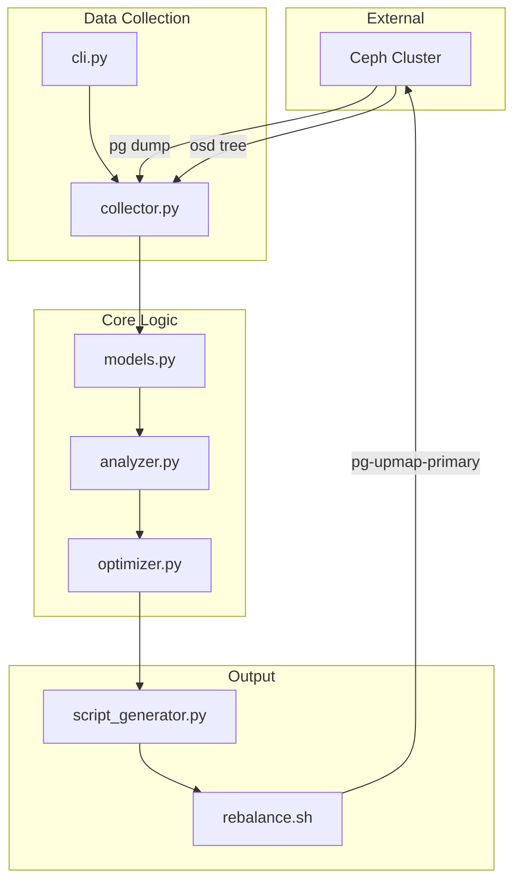
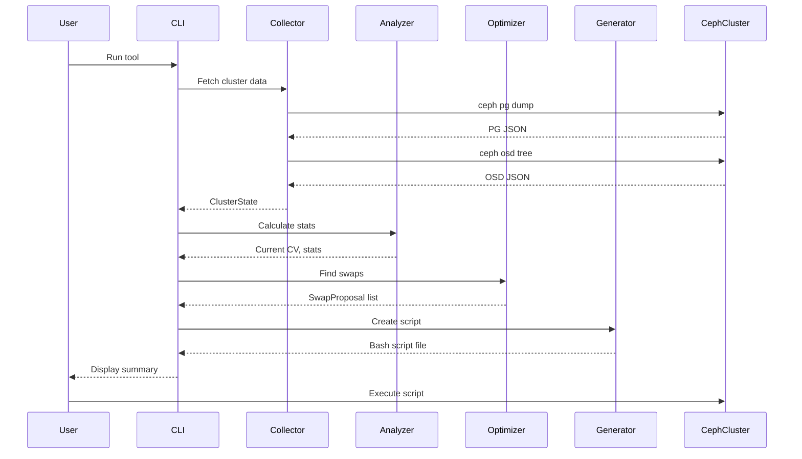

# MVP Architecture Overview

## System Architecture



## Data Flow



## Component Responsibilities

| Component | Input | Output | Responsibility |
|-----------|-------|--------|----------------|
| **cli.py** | CLI args | Terminal output | Orchestrate workflow, display results |
| **collector.py** | Ceph commands | ClusterState | Execute Ceph CLI, parse JSON |
| **models.py** | - | Data classes | Define data structures |
| **analyzer.py** | ClusterState | Statistics | Calculate distribution metrics |
| **optimizer.py** | ClusterState | SwapProposal[] | Find beneficial swaps |
| **script_generator.py** | SwapProposal[] | Bash script | Generate executable commands |

## Key Algorithms

### Variance Calculation
```
variance = Σ(primary_count_i - mean)² / n

where:
  n = number of OSDs
  primary_count_i = number of primaries on OSD i
  mean = total_primaries / n
```

### Greedy Optimization
```
WHILE variance > target AND iteration < max:
  1. Identify donor OSDs (count > mean + threshold)
  2. Identify receiver OSDs (count < mean - threshold)
  3. For each PG on donor OSD:
     - Check if any receiver OSD is in acting set
     - Simulate swap and calculate new variance
     - Track best swap (highest variance reduction)
  4. Apply best swap to state
  5. Record swap in proposal list
END WHILE
```

## Simplifications for MVP

| Full Spec Feature | MVP Implementation | Rationale |
|-------------------|-------------------|-----------|
| Multi-dimensional scoring | Single variance metric | Simpler algorithm, faster to implement |
| Host-level balancing | OSD-level only | Core functionality first |
| Pool-level balancing | All pools together | Simplify initial version |
| JSON export | Terminal output only | Reduce scope |
| Advanced CLI options | Basic flags only | Focus on core functionality |
| Comprehensive tests | Integration test only | Validate end-to-end behavior |

## Files Created

```
ceph_primary_balancer/
├── src/ceph_primary_balancer/
│   ├── __init__.py          (~10 lines)
│   ├── models.py            (~50 lines) - Data classes
│   ├── collector.py         (~100 lines) - Ceph data fetching
│   ├── analyzer.py          (~80 lines) - Statistics
│   ├── optimizer.py         (~120 lines) - Greedy algorithm
│   ├── script_generator.py  (~60 lines) - Bash generation
│   └── cli.py               (~70 lines) - Entry point
├── tests/
│   ├── fixtures/
│   │   ├── sample_pg_dump.json
│   │   └── sample_osd_tree.json
│   └── test_integration.py  (~100 lines)
├── requirements.txt         (minimal or none)
├── .gitignore
└── docs/
    └── MVP-USAGE.md

Total: ~590 lines of code
```

## Expected Performance

| Metric | Expected Value |
|--------|---------------|
| Data collection time | 10-30 seconds |
| Analysis time | < 1 second |
| Optimization time | 1-5 seconds for 1000 PGs |
| Script generation | < 1 second |
| Memory usage | < 100 MB for 10,000 PGs |

## Validation Checklist

Before declaring MVP complete:

- [ ] Tool runs without errors on real cluster
- [ ] Statistics match manual calculations
- [ ] All proposed swaps have valid new primaries (in acting set)
- [ ] Generated script syntax is valid bash
- [ ] Script successfully executes `pg-upmap-primary` commands
- [ ] Variance decreases after optimization
- [ ] Target CV is achieved (or no more beneficial swaps exist)
- [ ] Documentation covers basic usage

## Next Steps After MVP

Once MVP is validated:

1. **Performance testing** - Test with large clusters (10,000+ PGs)
2. **Host-level balancing** - Add multi-dimensional optimization
3. **Pool filtering** - Allow balancing specific pools
4. **JSON export** - Add machine-readable output
5. **CI/CD** - Set up automated testing
6. **Packaging** - Prepare for PyPI distribution
