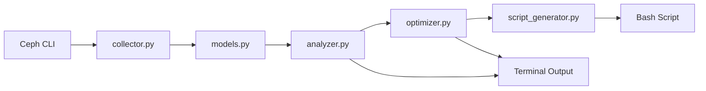

# Ceph Primary PG Balancer - MVP Implementation Plan

## Executive Summary

This plan defines a Minimum Viable Product (MVP) for the Ceph Primary PG Balancer tool. The MVP focuses on **OSD-level primary balancing only**, deferring host-level and pool-level optimizations for future iterations.

**MVP Goal:** Create a working tool that can analyze primary PG distribution and generate executable rebalancing scripts to minimize OSD-level variance.

---

## MVP Scope

### ✅ Included in MVP

| Feature | Description |
|---------|-------------|
| **Data Collection** | Fetch PG and OSD data from Ceph CLI |
| **OSD-Level Analysis** | Calculate statistics (mean, std dev, CV) for primary distribution |
| **Simple Optimization** | Greedy algorithm focusing on OSD balance only |
| **Script Generation** | Produce executable bash script with `pg-upmap-primary` commands |
| **Basic CLI** | Simple command-line interface with `--dry-run` flag |
| **Terminal Output** | Human-readable summary of current/proposed state |
| **Mock Testing** | Test with sample Ceph JSON data |

### ❌ Deferred for Later

| Feature | Rationale for Deferral |
|---------|------------------------|
| Host-level optimization | Adds complexity; OSD balance is primary concern |
| Pool-level optimization | Can be added incrementally |
| Multi-dimensional scoring | MVP uses simple variance calculation |
| Advanced CLI options | Keep interface minimal initially |
| JSON export | Terminal output sufficient for MVP |
| Comprehensive error handling | Basic validation only |
| Unit test suite | Integration test with mock data sufficient |
| Weight-proportional balancing | Simple equal distribution first |

---

## Architecture

### Module Structure (Simplified)

```
ceph_primary_balancer/
├── __init__.py
├── models.py              # Data classes
├── collector.py           # Fetch data from Ceph
├── analyzer.py            # Calculate statistics
├── optimizer.py           # Greedy balancing algorithm
├── script_generator.py    # Generate bash script
└── cli.py                 # Main entry point
```

### Data Flow



---

## Detailed Implementation Plan

### Step 1: Project Setup

**Files to create:**
- `requirements.txt` - Python dependencies
- `.gitignore` - Ignore Python artifacts
- `src/ceph_primary_balancer/__init__.py` - Package initialization
- `tests/fixtures/` - Sample Ceph command outputs

**Dependencies:**
```
# requirements.txt (minimal)
python >= 3.8
(no external dependencies - use stdlib only for MVP)
```

**Validation:**
- Project structure follows Python best practices
- Can import package successfully

---

### Step 2: Data Models

**File:** `src/ceph_primary_balancer/models.py`

**Classes to implement:**

```python
@dataclass
class PGInfo:
    """Represents a single Placement Group"""
    pgid: str              # e.g., "3.a1"
    pool_id: int           # e.g., 3
    acting: List[int]      # e.g., [12, 45, 78]
    
    @property
    def primary(self) -> int:
        """First OSD in acting set is primary"""
        return self.acting[0]

@dataclass
class OSDInfo:
    """Represents an OSD with primary count"""
    osd_id: int
    primary_count: int = 0     # Will be calculated
    total_pg_count: int = 0    # Total PGs (primary + replica)

@dataclass
class ClusterState:
    """Complete cluster state"""
    pgs: Dict[str, PGInfo]
    osds: Dict[int, OSDInfo]
    
@dataclass
class SwapProposal:
    """Proposed primary reassignment"""
    pgid: str
    old_primary: int
    new_primary: int
    variance_improvement: float
```

**Validation:**
- Can create instances of all classes
- PGInfo.primary property returns correct OSD ID

---

### Step 3: Data Collection

**File:** `src/ceph_primary_balancer/collector.py`

**Key functions:**

```python
def run_ceph_command(cmd: List[str]) -> dict:
    """Execute ceph command and return JSON output"""
    # Use subprocess.run()
    # Parse JSON output
    # Handle basic errors (command not found, invalid JSON)

def collect_pg_data() -> Dict[str, PGInfo]:
    """Fetch all PG information"""
    # Run: ceph pg dump pgs -f json
    # Extract: pgid, pool_id, acting set
    # Return dict of PGInfo objects

def collect_osd_data() -> Dict[int, OSDInfo]:
    """Get list of all OSDs"""
    # Run: ceph osd tree -f json
    # Extract OSD IDs
    # Initialize OSDInfo with zero counts
    # Return dict of OSDInfo objects

def build_cluster_state() -> ClusterState:
    """Combine PG and OSD data into ClusterState"""
    # Collect PGs and OSDs
    # Calculate primary_count for each OSD
    # Calculate total_pg_count for each OSD
    # Return ClusterState
```

**Validation:**
- Can execute `ceph` commands (or fail gracefully)
- Correctly parses real Ceph JSON output
- Accurately counts primaries per OSD

---

### Step 4: Statistical Analysis

**File:** `src/ceph_primary_balancer/analyzer.py`

**Key functions:**

```python
@dataclass
class Statistics:
    mean: float
    std_dev: float
    cv: float              # Coefficient of variation
    min_val: int
    max_val: int
    p50: float            # Median

def calculate_statistics(counts: List[int]) -> Statistics:
    """Calculate stats for a distribution"""
    # Use statistics module from stdlib
    # Calculate: mean, stdev, cv (stdev/mean)
    # Calculate: min, max, median
    
def identify_donors(osds: Dict[int, OSDInfo], threshold_pct: float = 0.1) -> List[int]:
    """Find OSDs with too many primaries"""
    # Calculate mean
    # Return OSD IDs where count > mean * (1 + threshold_pct)
    
def identify_receivers(osds: Dict[int, OSDInfo], threshold_pct: float = 0.1) -> List[int]:
    """Find OSDs with too few primaries"""
    # Calculate mean
    # Return OSD IDs where count < mean * (1 - threshold_pct)
    
def print_summary(state: ClusterState, stats: Statistics):
    """Print human-readable summary to terminal"""
    # Format and display current distribution
    # Show mean, std dev, CV, min, max
    # List top 5 donors and receivers
```

**Validation:**
- Statistics calculations are accurate (test with known data)
- CV correctly identifies imbalanced clusters (CV > 20%)
- Terminal output is readable and informative

---

### Step 5: Greedy Optimization Algorithm

**File:** `src/ceph_primary_balancer/optimizer.py`

**Key functions:**

```python
def calculate_variance(osds: Dict[int, OSDInfo]) -> float:
    """Calculate variance of primary distribution"""
    # Extract all primary counts
    # Calculate variance: Σ(count_i - mean)² / n
    
def find_best_swap(
    state: ClusterState,
    donors: List[int],
    receivers: List[int]
) -> Optional[SwapProposal]:
    """Find single best swap that reduces variance"""
    
    current_variance = calculate_variance(state.osds)
    best_swap = None
    best_improvement = 0
    
    # For each PG where donor is primary:
    for pg in state.pgs.values():
        if pg.primary not in donors:
            continue
            
        # For each OSD in acting set:
        for candidate_osd in pg.acting[1:]:  # Skip current primary
            if candidate_osd not in receivers:
                continue
            
            # Calculate variance after swap
            new_variance = simulate_swap_variance(state, pg.pgid, candidate_osd)
            improvement = current_variance - new_variance
            
            if improvement > best_improvement:
                best_improvement = improvement
                best_swap = SwapProposal(
                    pgid=pg.pgid,
                    old_primary=pg.primary,
                    new_primary=candidate_osd,
                    variance_improvement=improvement
                )
    
    return best_swap

def optimize_primaries(
    state: ClusterState,
    target_cv: float = 0.10,
    max_iterations: int = 1000
) -> List[SwapProposal]:
    """Greedy algorithm to find all beneficial swaps"""
    
    swaps = []
    
    for iteration in range(max_iterations):
        # Recalculate donors/receivers based on current state
        stats = calculate_statistics([osd.primary_count for osd in state.osds.values()])
        
        if stats.cv <= target_cv:
            print(f"Target CV {target_cv} achieved!")
            break
        
        donors = identify_donors(state.osds)
        receivers = identify_receivers(state.osds)
        
        if not donors or not receivers:
            print("No more donors or receivers")
            break
        
        # Find best swap
        swap = find_best_swap(state, donors, receivers)
        
        if swap is None:
            print("No beneficial swaps found")
            break
        
        # Apply swap to state
        apply_swap(state, swap)
        swaps.append(swap)
        
        if iteration % 10 == 0:
            print(f"Iteration {iteration}: CV = {stats.cv:.2%}, Swaps = {len(swaps)}")
    
    return swaps
```

**Validation:**
- Algorithm terminates (doesn't infinite loop)
- Each swap actually reduces variance
- Final CV is lower than initial CV
- All new primaries are in acting sets

---

### Step 6: Script Generation

**File:** `src/ceph_primary_balancer/script_generator.py`

**Key functions:**

```python
def generate_script(swaps: List[SwapProposal], output_path: str):
    """Generate executable bash script"""
    
    script_content = f'''#!/bin/bash
# Ceph Primary PG Rebalancing Script
# Generated: {datetime.now().isoformat()}
# Total commands: {len(swaps)}

set -e

echo "This script will execute {len(swaps)} pg-upmap-primary commands."
read -p "Continue? [y/N] " confirm
[[ "$confirm" =~ ^[Yy]$ ]] || exit 1

TOTAL={len(swaps)}
COUNT=0
FAILED=0

apply_mapping() {{
    local pgid=$1
    local new_primary=$2
    ((COUNT++))
    
    if ceph osd pg-upmap-primary "$pgid" "$new_primary" 2>/dev/null; then
        printf "[%3d/%d] %-12s -> OSD.%-4d OK\\n" "$COUNT" "$TOTAL" "$pgid" "$new_primary"
    else
        printf "[%3d/%d] %-12s -> OSD.%-4d FAILED\\n" "$COUNT" "$TOTAL" "$pgid" "$new_primary"
        ((FAILED++))
    fi
}}

'''
    
    # Add all swap commands
    for swap in swaps:
        script_content += f'apply_mapping "{swap.pgid}" {swap.new_primary}\n'
    
    script_content += f'''
echo ""
echo "Complete: $((TOTAL - FAILED)) successful, $FAILED failed"
'''
    
    # Write to file
    with open(output_path, 'w') as f:
        f.write(script_content)
    
    # Make executable
    os.chmod(output_path, 0o755)
```

**Validation:**
- Generated script is valid bash
- Script has execute permissions
- Commands are in correct format

---

### Step 7: CLI Interface

**File:** `src/ceph_primary_balancer/cli.py`

**Implementation:**

```python
#!/usr/bin/env python3
import argparse
from . import collector, analyzer, optimizer, script_generator

def main():
    parser = argparse.ArgumentParser(
        description='Analyze and optimize Ceph primary PG distribution'
    )
    parser.add_argument('--dry-run', action='store_true',
                       help='Analyze only, do not generate script')
    parser.add_argument('--target-cv', type=float, default=0.10,
                       help='Target coefficient of variation (default: 0.10)')
    parser.add_argument('--output', default='./rebalance_primaries.sh',
                       help='Output script path')
    
    args = parser.parse_args()
    
    print("Collecting cluster data...")
    state = collector.build_cluster_state()
    
    print("\nCurrent State:")
    current_stats = analyzer.calculate_statistics(
        [osd.primary_count for osd in state.osds.values()]
    )
    analyzer.print_summary(state, current_stats)
    
    if current_stats.cv <= args.target_cv:
        print(f"\nCluster already balanced (CV = {current_stats.cv:.2%})")
        return
    
    print(f"\nOptimizing (target CV = {args.target_cv:.2%})...")
    swaps = optimizer.optimize_primaries(state, args.target_cv)
    
    print(f"\nProposed {len(swaps)} primary reassignments")
    
    proposed_stats = analyzer.calculate_statistics(
        [osd.primary_count for osd in state.osds.values()]
    )
    print(f"Improvement: {current_stats.cv:.2%} -> {proposed_stats.cv:.2%}")
    
    if not args.dry_run:
        script_generator.generate_script(swaps, args.output)
        print(f"\nScript written to: {args.output}")
    else:
        print("\nDry run mode - no script generated")

if __name__ == '__main__':
    main()
```

**Validation:**
- CLI arguments parse correctly
- `--dry-run` prevents script generation
- Help text is clear and accurate

---

### Step 8: Testing with Mock Data

**File:** `tests/fixtures/sample_pg_dump.json`

Create sample Ceph output with known characteristics:
- 100 PGs across 10 OSDs
- Intentionally imbalanced (some OSDs have 5 primaries, others have 15)
- All PGs have 3-way replication

**File:** `tests/test_integration.py`

```python
def test_mock_cluster_balancing():
    """Integration test with mock data"""
    # Load mock data
    # Run full optimization
    # Verify:
    #   - Final CV < initial CV
    #   - All swaps have valid new primaries
    #   - Script is generated correctly
```

**Validation:**
- Test passes with mock data
- Demonstrates clear improvement
- All swaps are valid

---

### Step 9: Error Handling

Add basic error handling for common scenarios:

```python
# In collector.py
def run_ceph_command(cmd: List[str]) -> dict:
    try:
        result = subprocess.run(cmd, capture_output=True, text=True, check=True)
        return json.loads(result.stdout)
    except FileNotFoundError:
        print("ERROR: 'ceph' command not found. Is Ceph installed?")
        sys.exit(1)
    except subprocess.CalledProcessError as e:
        print(f"ERROR: Ceph command failed: {e}")
        sys.exit(1)
    except json.JSONDecodeError as e:
        print(f"ERROR: Invalid JSON from Ceph: {e}")
        sys.exit(1)
```

**Scenarios to handle:**
- Ceph CLI not available
- Ceph command fails
- Invalid JSON output
- No PGs found
- Already balanced cluster

---

### Step 10: Documentation

**File:** `docs/MVP-USAGE.md`

Document MVP-specific usage:

```markdown
# MVP Usage Guide

## Limitations

This MVP version includes:
- ✅ OSD-level primary balancing
- ❌ Host-level optimization (coming in v2)
- ❌ Pool-level optimization (coming in v2)
- ❌ JSON export (coming in v2)

## Basic Usage

1. Analyze current state (dry run):
   ```bash
   python -m ceph_primary_balancer.cli --dry-run
   ```

2. Generate rebalancing script:
   ```bash
   python -m ceph_primary_balancer.cli --output ./rebalance.sh
   ```

3. Review and apply:
   ```bash
   ./rebalance.sh
   ```

## What to Expect

- Analysis takes ~30 seconds for large clusters
- Script generation is instant
- Each `pg-upmap-primary` command takes <1 second to execute
```

---

## Implementation Timeline

### Phase 1: Foundation
1. Set up project structure
2. Create data models
3. Implement Ceph data collection

### Phase 2: Core Logic
4. Build statistical analysis
5. Develop optimization algorithm
6. Generate bash scripts

### Phase 3: Integration
7. Create CLI interface
8. Add error handling
9. Test with mock data
10. Document usage

---

## Success Criteria

The MVP is complete when:

- ✅ Tool can analyze a real Ceph cluster
- ✅ Correctly identifies imbalanced primary distribution
- ✅ Generates valid `pg-upmap-primary` commands
- ✅ Demonstrably reduces OSD-level variance
- ✅ Script executes without errors
- ✅ All proposed new primaries are in acting sets
- ✅ Basic documentation exists

---

## Future Enhancements (Post-MVP)

After MVP validation, consider adding:

1. **Host-level balancing** - Prevent network hotspots
2. **Pool-level balancing** - Per-pool optimization
3. **Multi-dimensional scoring** - Weighted composite score
4. **JSON export** - Machine-readable output
5. **Advanced CLI** - More configuration options
6. **Unit tests** - Comprehensive test coverage
7. **CI/CD pipeline** - Automated testing and releases
8. **Performance optimization** - Handle 100,000+ PG clusters

---

## Risk Assessment

| Risk | Likelihood | Impact | Mitigation |
|------|------------|--------|------------|
| Ceph API changes | Low | High | Use stable JSON output format |
| Performance issues | Medium | Medium | Optimize algorithm if needed |
| Invalid swaps | Low | High | Validate acting sets before proposing |
| User applies during recovery | Low | High | Add cluster health check |

---

## Appendix: File Checklist

**Project Files:**
```
ceph_primary_balancer/
├── .gitignore
├── requirements.txt
├── README.md (update for MVP)
├── src/
│   └── ceph_primary_balancer/
│       ├── __init__.py
│       ├── models.py
│       ├── collector.py
│       ├── analyzer.py
│       ├── optimizer.py
│       ├── script_generator.py
│       └── cli.py
├── tests/
│   ├── fixtures/
│   │   ├── sample_pg_dump.json
│   │   └── sample_osd_tree.json
│   └── test_integration.py
└── docs/
    └── MVP-USAGE.md
```

**Estimated LOC:**
- models.py: ~50 lines
- collector.py: ~100 lines
- analyzer.py: ~80 lines
- optimizer.py: ~120 lines
- script_generator.py: ~60 lines
- cli.py: ~70 lines
- **Total: ~480 lines of Python**

This is a reasonable size for an MVP and can be completed incrementally.
