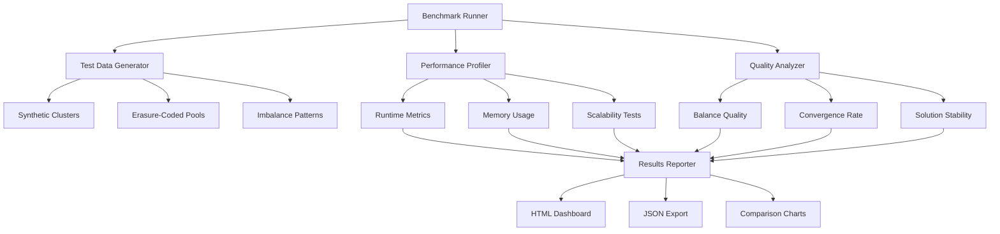

# Phase 4 & Phase 5 Implementation Plan
## Ceph Primary PG Balancer - Road to v1.0.0 and Beyond

**Date:** 2026-02-03  
**Current Version:** 0.4.0 (85% Complete)  
**Target Version:** 1.0.0 (Phase 4) → 1.1.0 (Phase 5)  
**Status:** Ready for Implementation

---

## Table of Contents

1. [Executive Summary](#executive-summary)
2. [Phase 4: Production Readiness (v1.0.0)](#phase-4-production-readiness-v100)
3. [Phase 5: Benchmark Framework (v1.1.0)](#phase-5-benchmark-framework-v110)
4. [Success Criteria](#success-criteria)
5. [Risk Assessment](#risk-assessment)
6. [Timeline & Milestones](#timeline--milestones)

---

## Executive Summary

### Current State ✅

The Ceph Primary PG Balancer is **85% complete** with solid foundations:

- ✅ **Phase 1 (v0.2.0):** Multi-dimensional optimization with host-level balancing
- ✅ **Phase 2 (v0.3.0):** Three-dimensional optimization including pool-level awareness
- ✅ **Phase 3 (v0.4.0):** JSON export, markdown reporting, enhanced terminal output
- ✅ **Testing:** 25+ integration tests, all passing
- ✅ **Performance:** <5s for 10k PGs, <1GB memory for 100k PGs
- ✅ **Dependencies:** Zero external dependencies (stdlib only)

### Phase 4 Goals (v1.0.0 - Production Ready)

The final **15%** to reach production readiness:

1. **Critical Production Safety**
   - Limit swap count with `--max-changes`
   - Health checks in generated scripts
   - Automatic rollback script generation
   - Comprehensive unit test coverage

2. **Advanced Configuration**
   - JSON configuration file support
   - Output directory organization
   - Verbose/quiet logging modes
   - Batch execution with progress tracking

3. **Complete Documentation**
   - Updated usage guides for all phases
   - Advanced usage patterns
   - Configuration reference
   - Production deployment best practices

### Phase 5 Goals (v1.1.0 - Benchmark Framework)

Establish foundation for algorithm comparison and performance optimization:

1. **Performance Benchmarking**
   - Runtime performance measurement
   - Memory usage profiling
   - Scalability testing (1k → 100k PGs)
   - Performance regression detection

2. **Optimization Quality Benchmarking**
   - Multi-dimensional balance quality metrics
   - Convergence rate measurement
   - Solution stability analysis
   - Comparison framework for future algorithms

3. **Test Data Generation**
   - Synthetic cluster generator
   - Erasure-coded pool scenarios (EC 8+3, 4+2, etc.)
   - Realistic imbalance patterns
   - Edge case scenario generation

4. **Benchmark Infrastructure**
   - Reproducible test scenarios
   - Automated benchmark runner
   - Results visualization and reporting
   - Historical trend tracking

---

## Phase 4: Production Readiness (v1.0.0)

### Sprint 1: Critical Production Safety Features

**Duration:** Week 1  
**Focus:** Essential safety features for production deployment

#### Task 1.1: Implement `--max-changes` Option

**File:** [`src/ceph_primary_balancer/cli.py`](../src/ceph_primary_balancer/cli.py)  
**Lines:** ~25 lines  
**Priority:** HIGH

**Implementation:**

```python
# Add CLI argument (around line 77, after --pool)
parser.add_argument(
    '--max-changes',
    type=int,
    default=None,
    help='Maximum number of primary reassignments to generate (default: unlimited)'
)

# Apply limit after optimization (around line 206, after optimizer.optimize_primaries)
if args.max_changes and len(swaps) > args.max_changes:
    print(f"\nLimiting to {args.max_changes} changes (optimizer found {len(swaps)} optimal swaps)")
    print(f"Remaining {len(swaps) - args.max_changes} swaps deferred for future runs")
    swaps = swaps[:args.max_changes]
    
    # Recalculate proposed statistics with limited swaps
    limited_state = copy.deepcopy(original_state)
    for swap in swaps:
        optimizer.apply_swap(limited_state, swap)
    state = limited_state
```

**Testing:**
```python
# Test case: Verify max-changes limit is respected
def test_max_changes_limit():
    # Run with --max-changes 10
    # Verify exactly 10 swaps generated
    # Verify message shows total available swaps
```

**Success Criteria:**
- ✅ CLI accepts `--max-changes N` argument
- ✅ Exactly N swaps generated when N < total optimal swaps
- ✅ Statistics reflect limited swap set
- ✅ Clear messaging about deferred swaps

---

#### Task 1.2: Add Health Checks to Generated Scripts

**File:** [`src/ceph_primary_balancer/script_generator.py`](../src/ceph_primary_balancer/script_generator.py)  
**Lines:** ~45 lines  
**Priority:** HIGH

**Implementation:**

```bash
# Insert after confirmation prompt (line 66), before apply_mapping function
echo ""
echo "=== Pre-Flight Health Check ==="
echo "Checking cluster health status..."

HEALTH=$(ceph health 2>/dev/null)
HEALTH_STATUS=$?

if [ $HEALTH_STATUS -ne 0 ]; then
    echo "ERROR: Cannot connect to Ceph cluster"
    echo "Please verify:"
    echo "  1. Ceph cluster is running"
    echo "  2. ceph.conf is properly configured"
    echo "  3. You have proper authentication"
    exit 1
fi

echo "Cluster health: $HEALTH"

# Check if health is acceptable
if [[ "$HEALTH" =~ ^HEALTH_ERR ]]; then
    echo ""
    echo "WARNING: Cluster is in HEALTH_ERR state"
    echo "It is NOT recommended to proceed with rebalancing"
    read -p "Are you sure you want to continue? [y/N] " health_override
    if [[ ! "$health_override" =~ ^[Yy]$ ]]; then
        echo "Aborting for safety"
        exit 1
    fi
elif [[ "$HEALTH" =~ ^HEALTH_WARN ]]; then
    echo ""
    echo "NOTICE: Cluster has warnings: $HEALTH"
    read -p "Continue with rebalancing? [y/N] " health_continue
    if [[ ! "$health_continue" =~ ^[Yy]$ ]]; then
        echo "Aborting"
        exit 1
    fi
fi

echo ""
echo "=== Health Check Passed ==="
echo ""
```

**Testing:**
- Mock `ceph health` command in test environment
- Verify script exits on HEALTH_ERR (without override)
- Verify script prompts on HEALTH_WARN
- Verify script proceeds on HEALTH_OK

**Success Criteria:**
- ✅ Script checks cluster health before execution
- ✅ Script exits on connection failure
- ✅ Script prompts on HEALTH_ERR/HEALTH_WARN
- ✅ Script proceeds automatically on HEALTH_OK

---

#### Task 1.3: Implement Rollback Script Generation

**File:** [`src/ceph_primary_balancer/script_generator.py`](../src/ceph_primary_balancer/script_generator.py)  
**Lines:** ~60 lines  
**Priority:** HIGH

**Implementation:**

```python
def generate_rollback_script(swaps: List[SwapProposal], output_path: str) -> str:
    """
    Generate a rollback script that reverses all proposed changes.
    
    The rollback script can be executed if the rebalancing causes unexpected
    issues, restoring the cluster to its original primary distribution.
    
    Args:
        swaps: Original swap proposals to reverse
        output_path: Base output path (rollback uses *_rollback.sh)
        
    Returns:
        Path to the generated rollback script
        
    Example:
        >>> swaps = [SwapProposal("3.a1", 12, 45, 0.5)]
        >>> rollback_path = generate_rollback_script(swaps, "rebalance.sh")
        >>> print(rollback_path)
        'rebalance_rollback.sh'
    """
    # Create reverse swaps (swap old_primary and new_primary)
    reverse_swaps = []
    for swap in swaps:
        reverse_swap = SwapProposal(
            pgid=swap.pgid,
            old_primary=swap.new_primary,  # Reversed
            new_primary=swap.old_primary,   # Reversed
            score_improvement=0.0  # Not relevant for rollback
        )
        reverse_swaps.append(reverse_swap)
    
    # Generate rollback script path
    if output_path.endswith('.sh'):
        rollback_path = output_path.replace('.sh', '_rollback.sh')
    else:
        rollback_path = output_path + '_rollback.sh'
    
    # Generate timestamp for rollback script
    timestamp = datetime.now().isoformat()
    total_commands = len(reverse_swaps)
    
    # Build rollback script with clear header
    script_content = f'''#!/bin/bash
# Ceph Primary PG Rebalancing ROLLBACK Script
# Generated: {timestamp}
# Total commands: {total_commands}
#
# This script REVERSES the changes from: {os.path.basename(output_path)}
# Use this script if rebalancing causes unexpected issues

set -e

echo "=========================================="
echo "ROLLBACK SCRIPT"
echo "=========================================="
echo "This will REVERSE {total_commands} primary reassignments"
echo "Original script: {os.path.basename(output_path)}"
echo ""
read -p "Continue with rollback? [y/N] " confirm
[[ "$confirm" =~ ^[Yy]$ ]] || exit 1

TOTAL={total_commands}
COUNT=0
FAILED=0

apply_mapping() {{
    local pgid=$1
    local new_primary=$2
    ((COUNT++))
    
    if ceph osd pg-upmap-primary "$pgid" "$new_primary" 2>/dev/null; then
        printf "[%3d/%d] %-12s -> OSD.%-4d OK (ROLLBACK)\\n" "$COUNT" "$TOTAL" "$pgid" "$new_primary"
    else
        printf "[%3d/%d] %-12s -> OSD.%-4d FAILED\\n" "$COUNT" "$TOTAL" "$pgid" "$new_primary"
        ((FAILED++))
    fi
}}

'''
    
    # Add rollback commands
    for swap in reverse_swaps:
        script_content += f'apply_mapping "{swap.pgid}" {swap.new_primary}\n'
    
    # Add summary footer
    script_content += f'''
echo ""
echo "Rollback complete: $((TOTAL - FAILED)) successful, $FAILED failed"
'''
    
    # Write rollback script
    try:
        with open(rollback_path, 'w') as f:
            f.write(script_content)
        os.chmod(rollback_path, 0o755)
    except OSError as e:
        print(f"Warning: Could not generate rollback script: {e}")
        return None
    
    return rollback_path
```

**CLI Integration (in [`cli.py`](../src/ceph_primary_balancer/cli.py)):**

```python
# After script generation (around line 318)
if not args.dry_run:
    script_generator.generate_script(swaps, args.output)
    print(f"\n" + "="*60)
    print(f"Rebalancing script written to: {args.output}")
    
    # Generate rollback script
    rollback_path = script_generator.generate_rollback_script(swaps, args.output)
    if rollback_path:
        print(f"Rollback script written to: {rollback_path}")
        print("\nIMPORTANT: Keep the rollback script safe in case you need to reverse changes")
    
    print("="*60)
```

**Testing:**
- Verify rollback script reverses all swaps correctly
- Test rollback script is executable
- Verify forward + rollback = original state

**Success Criteria:**
- ✅ Rollback script generated automatically
- ✅ Rollback swaps are correctly reversed
- ✅ Rollback script has clear warnings
- ✅ Forward + rollback restores original state

---

#### Task 1.4: Create Comprehensive Unit Tests for Optimizer Module

**File:** `tests/test_optimizer.py` (NEW)  
**Lines:** ~250 lines  
**Priority:** HIGH

**Implementation:**

```python
"""Unit tests for optimizer module."""

import unittest
from src.ceph_primary_balancer.optimizer import (
    calculate_variance,
    simulate_swap_score,
    apply_swap,
    find_best_swap,
    optimize_primaries
)
from src.ceph_primary_balancer.models import (
    ClusterState, PGInfo, OSDInfo, HostInfo, PoolInfo, SwapProposal
)
from src.ceph_primary_balancer.scorer import Scorer


class TestCalculateVariance(unittest.TestCase):
    """Test variance calculation."""
    
    def test_variance_simple_case(self):
        """Test variance with known values."""
        osds = {
            1: OSDInfo(1, "host1", 10, 100),
            2: OSDInfo(2, "host1", 10, 100),
            3: OSDInfo(3, "host2", 10, 100)
        }
        variance = calculate_variance(osds)
        self.assertAlmostEqual(variance, 0.0, places=2)
    
    def test_variance_with_imbalance(self):
        """Test variance with imbalanced distribution."""
        osds = {
            1: OSDInfo(1, "host1", 5, 100),
            2: OSDInfo(2, "host1", 10, 100),
            3: OSDInfo(3, "host2", 15, 100)
        }
        variance = calculate_variance(osds)
        # Expected: mean=10, variance=((5-10)²+(10-10)²+(15-10)²)/3 = 50/3 = 16.67
        self.assertAlmostEqual(variance, 16.67, places=1)
    
    def test_variance_empty_osds(self):
        """Test variance with empty OSD dict."""
        variance = calculate_variance({})
        self.assertEqual(variance, 0.0)


class TestSimulateSwapScore(unittest.TestCase):
    """Test swap simulation without modifying state."""
    
    def setUp(self):
        """Create test cluster state."""
        self.osds = {
            1: OSDInfo(1, "host1", 15, 100),
            2: OSDInfo(2, "host1", 10, 100),
            3: OSDInfo(3, "host2", 5, 100)
        }
        self.pgs = {
            "1.0": PGInfo("1.0", 1, [1, 2, 3], 1)
        }
        self.state = ClusterState(self.pgs, self.osds, {}, {})
        self.scorer = Scorer(w_osd=1.0, w_host=0.0, w_pool=0.0)
    
    def test_simulate_swap_improves_score(self):
        """Test that simulating beneficial swap shows improvement."""
        # Swapping from OSD 1 (15 primaries) to OSD 3 (5 primaries) should improve balance
        new_score = simulate_swap_score(self.state, "1.0", 3, self.scorer)
        current_score = self.scorer.calculate_score(self.state)
        self.assertLess(new_score, current_score)
    
    def test_simulate_swap_doesnt_modify_state(self):
        """Test that simulation doesn't modify original state."""
        original_count_1 = self.osds[1].primary_count
        original_count_3 = self.osds[3].primary_count
        
        simulate_swap_score(self.state, "1.0", 3, self.scorer)
        
        self.assertEqual(self.osds[1].primary_count, original_count_1)
        self.assertEqual(self.osds[3].primary_count, original_count_3)


class TestApplySwap(unittest.TestCase):
    """Test applying swaps to cluster state."""
    
    def setUp(self):
        """Create test cluster state."""
        self.osds = {
            1: OSDInfo(1, "host1", 15, 100),
            2: OSDInfo(2, "host1", 10, 100),
            3: OSDInfo(3, "host2", 5, 100)
        }
        self.pgs = {
            "1.0": PGInfo("1.0", 1, [1, 2, 3], 1)
        }
        self.state = ClusterState(self.pgs, self.osds, {}, {})
    
    def test_apply_swap_updates_osd_counts(self):
        """Test that applying swap updates OSD primary counts."""
        swap = SwapProposal("1.0", 1, 3, 0.5)
        apply_swap(self.state, swap)
        
        self.assertEqual(self.osds[1].primary_count, 14)
        self.assertEqual(self.osds[3].primary_count, 6)
    
    def test_apply_swap_updates_pg_acting(self):
        """Test that applying swap updates PG acting list."""
        swap = SwapProposal("1.0", 1, 2, 0.5)
        apply_swap(self.state, swap)
        
        self.assertEqual(self.pgs["1.0"].acting[0], 2)
        self.assertIn(1, self.pgs["1.0"].acting[1:])


class TestFindBestSwap(unittest.TestCase):
    """Test finding the best swap."""
    
    def setUp(self):
        """Create test cluster state."""
        self.osds = {
            1: OSDInfo(1, "host1", 15, 100),
            2: OSDInfo(2, "host1", 10, 100),
            3: OSDInfo(3, "host2", 5, 100)
        }
        self.pgs = {
            "1.0": PGInfo("1.0", 1, [1, 2, 3], 1),
            "1.1": PGInfo("1.1", 1, [1, 2, 3], 1),
            "1.2": PGInfo("1.2", 1, [1, 3, 2], 1)
        }
        self.state = ClusterState(self.pgs, self.osds, {}, {})
        self.scorer = Scorer(w_osd=1.0, w_host=0.0, w_pool=0.0)
    
    def test_find_best_swap_returns_swap(self):
        """Test that best swap is found."""
        donors = [1]  # OSD 1 has 15 primaries (above mean of 10)
        receivers = [3]  # OSD 3 has 5 primaries (below mean)
        
        swap = find_best_swap(self.state, donors, receivers, self.scorer)
        
        self.assertIsNotNone(swap)
        self.assertEqual(swap.old_primary, 1)
        self.assertEqual(swap.new_primary, 3)
        self.assertGreater(swap.score_improvement, 0)
    
    def test_find_best_swap_empty_donors(self):
        """Test with empty donor list."""
        swap = find_best_swap(self.state, [], [3], self.scorer)
        self.assertIsNone(swap)
    
    def test_find_best_swap_empty_receivers(self):
        """Test with empty receiver list."""
        swap = find_best_swap(self.state, [1], [], self.scorer)
        self.assertIsNone(swap)


class TestOptimizePrimaries(unittest.TestCase):
    """Test the main optimization loop."""
    
    def test_optimize_primaries_converges(self):
        """Test that optimization converges."""
        osds = {
            1: OSDInfo(1, "host1", 15, 100),
            2: OSDInfo(2, "host1", 10, 100),
            3: OSDInfo(3, "host2", 5, 100)
        }
        pgs = {
            f"1.{i}": PGInfo(f"1.{i}", 1, [1, 2, 3], 1)
            for i in range(15)
        }
        for i in range(10, 20):
            pgs[f"1.{i}"] = PGInfo(f"1.{i}", 2, [2, 1, 3], 2)
        for i in range(20, 25):
            pgs[f"1.{i}"] = PGInfo(f"1.{i}", 3, [3, 1, 2], 3)
        
        state = ClusterState(pgs, osds, {}, {})
        scorer = Scorer(w_osd=1.0, w_host=0.0, w_pool=0.0)
        
        swaps = optimize_primaries(state, target_cv=0.10, scorer=scorer)
        
        self.assertGreater(len(swaps), 0)
        # Verify final distribution is more balanced
        counts = [osd.primary_count for osd in osds.values()]
        self.assertLess(max(counts) - min(counts), 15 - 5)
    
    def test_optimize_primaries_empty_osds(self):
        """Test optimization with no OSDs."""
        state = ClusterState({}, {}, {}, {})
        swaps = optimize_primaries(state, target_cv=0.10)
        self.assertEqual(len(swaps), 0)


if __name__ == '__main__':
    unittest.main()
```

**Success Criteria:**
- ✅ All optimizer functions have unit tests
- ✅ Edge cases covered (empty inputs, single OSD, etc.)
- ✅ Test coverage ≥90% for optimizer module
- ✅ Tests run in <5 seconds

---

#### Task 1.5: Create Unit Tests for Analyzer Module

**File:** `tests/test_analyzer.py` (NEW)  
**Lines:** ~200 lines  
**Priority:** HIGH

**Implementation:**

```python
"""Unit tests for analyzer module."""

import unittest
from src.ceph_primary_balancer.analyzer import (
    calculate_statistics,
    identify_donors,
    identify_receivers,
    get_pool_statistics_summary
)
from src.ceph_primary_balancer.models import (
    ClusterState, OSDInfo, PoolInfo, Statistics
)


class TestCalculateStatistics(unittest.TestCase):
    """Test statistical calculations."""
    
    def test_statistics_known_values(self):
        """Test statistics with known inputs."""
        counts = [5, 5, 10, 10, 15, 15]
        stats = calculate_statistics(counts)
        
        self.assertAlmostEqual(stats.mean, 10.0)
        self.assertAlmostEqual(stats.min_val, 5)
        self.assertAlmostEqual(stats.max_val, 15)
        self.assertAlmostEqual(stats.p50, 10.0)
    
    def test_statistics_uniform_distribution(self):
        """Test with all identical values."""
        counts = [10, 10, 10, 10]
        stats = calculate_statistics(counts)
        
        self.assertAlmostEqual(stats.mean, 10.0)
        self.assertAlmostEqual(stats.std_dev, 0.0)
        self.assertAlmostEqual(stats.cv, 0.0)
    
    def test_statistics_empty_list_raises(self):
        """Test that empty list raises ValueError."""
        with self.assertRaises(ValueError):
            calculate_statistics([])
    
    def test_statistics_single_value(self):
        """Test with single value."""
        counts = [42]
        stats = calculate_statistics(counts)
        
        self.assertAlmostEqual(stats.mean, 42.0)
        self.assertAlmostEqual(stats.std_dev, 0.0)
        self.assertAlmostEqual(stats.cv, 0.0)


class TestIdentifyDonorsReceivers(unittest.TestCase):
    """Test donor and receiver identification."""
    
    def setUp(self):
        """Create test OSDs."""
        self.osds = {
            1: OSDInfo(1, "host1", 15, 100),  # Above mean
            2: OSDInfo(2, "host1", 10, 100),  # At mean
            3: OSDInfo(3, "host2", 5, 100)    # Below mean
        }
    
    def test_identify_donors_above_threshold(self):
        """Test donor identification."""
        donors = identify_donors(self.osds)
        self.assertIn(1, donors)
        self.assertNotIn(2, donors)  # At mean
        self.assertNotIn(3, donors)  # Below mean
    
    def test_identify_receivers_below_threshold(self):
        """Test receiver identification."""
        receivers = identify_receivers(self.osds)
        self.assertIn(3, receivers)
        self.assertNotIn(2, receivers)  # At mean
        self.assertNotIn(1, receivers)  # Above mean
    
    def test_donors_receivers_empty_dict(self):
        """Test with empty OSD dict."""
        donors = identify_donors({})
        receivers = identify_receivers({})
        self.assertEqual(len(donors), 0)
        self.assertEqual(len(receivers), 0)


class TestPoolStatistics(unittest.TestCase):
    """Test pool-level statistics."""
    
    def setUp(self):
        """Create test cluster with pools."""
        self.osds = {
            1: OSDInfo(1, "host1", 15, 100),
            2: OSDInfo(2, "host1", 10, 100),
            3: OSDInfo(3, "host2", 5, 100)
        }
        self.pools = {
            1: PoolInfo(1, "pool1", 15, {1: 10, 2: 3, 3: 2}),
            2: PoolInfo(2, "pool2", 15, {1: 5, 2: 7, 3: 3})
        }
        self.state = ClusterState({}, self.osds, {}, self.pools)
    
    def test_get_pool_statistics_summary(self):
        """Test pool statistics calculation."""
        pool_stats = get_pool_statistics_summary(self.state)
        
        self.assertEqual(len(pool_stats), 2)
        self.assertIn(1, pool_stats)
        self.assertIn(2, pool_stats)
        
        # Pool 1 is more imbalanced (10, 3, 2)
        self.assertGreater(pool_stats[1].cv, pool_stats[2].cv)


if __name__ == '__main__':
    unittest.main()
```

**Success Criteria:**
- ✅ All analyzer functions have unit tests
- ✅ Statistics calculations verified with known values
- ✅ Test coverage ≥90% for analyzer module
- ✅ Edge cases handled (empty inputs, single values, etc.)

---

### Sprint 2: Advanced Features & Configuration

**Duration:** Week 2  
**Focus:** Configuration file support and advanced CLI options

#### Task 2.1: Create Configuration Module

**File:** `src/ceph_primary_balancer/config.py` (NEW)  
**Lines:** ~100 lines  
**Priority:** MEDIUM

**Implementation:**

```python
"""Configuration file support for Ceph Primary PG Balancer."""

import json
import os
from typing import Dict, Any, Optional


class Config:
    """Load and manage configuration from JSON file.
    
    Supports hierarchical configuration with defaults that can be overridden
    by user-provided config files. CLI arguments take precedence over config file.
    
    Example config file (config.json):
    {
        "optimization": {
            "target_cv": 0.10,
            "max_changes": 500,
            "max_iterations": 10000
        },
        "scoring": {
            "weights": {
                "osd": 0.5,
                "host": 0.3,
                "pool": 0.2
            }
        },
        "output": {
            "directory": "./output",
            "json_export": true,
            "markdown_report": true
        },
        "script": {
            "batch_size": 50,
            "health_check": true,
            "generate_rollback": true
        }
    }
    """
    
    def __init__(self, config_path: Optional[str] = None):
        """Initialize configuration with defaults and optional file.
        
        Args:
            config_path: Optional path to JSON configuration file
        """
        self.settings = self._default_settings()
        if config_path:
            self.load_file(config_path)
    
    def _default_settings(self) -> Dict[str, Any]:
        """Return default configuration settings."""
        return {
            'optimization': {
                'target_cv': 0.10,
                'max_changes': None,
                'max_iterations': 10000
            },
            'scoring': {
                'weights': {
                    'osd': 0.5,
                    'host': 0.3,
                    'pool': 0.2
                }
            },
            'output': {
                'directory': './',
                'json_export': False,
                'markdown_report': False,
                'script_name': 'rebalance_primaries.sh'
            },
            'script': {
                'batch_size': 50,
                'health_check': True,
                'generate_rollback': True,
                'organized_by_pool': False
            },
            'logging': {
                'verbose': False,
                'quiet': False
            }
        }
    
    def load_file(self, path: str):
        """Load configuration from JSON file.
        
        Args:
            path: Path to JSON configuration file
            
        Raises:
            FileNotFoundError: If config file doesn't exist
            json.JSONDecodeError: If config file is invalid JSON
        """
        if not os.path.exists(path):
            raise FileNotFoundError(f"Configuration file not found: {path}")
        
        with open(path, 'r') as f:
            user_settings = json.load(f)
        
        self._merge_settings(user_settings)
    
    def _merge_settings(self, user_settings: Dict[str, Any]):
        """Deep merge user settings with defaults.
        
        User settings take precedence over defaults.
        
        Args:
            user_settings: User-provided settings dictionary
        """
        self._deep_merge(self.settings, user_settings)
    
    def _deep_merge(self, base: Dict, override: Dict):
        """Recursively merge override dict into base dict.
        
        Args:
            base: Base dictionary to merge into
            override: Override dictionary with precedence
        """
        for key, value in override.items():
            if key in base and isinstance(base[key], dict) and isinstance(value, dict):
                self._deep_merge(base[key], value)
            else:
                base[key] = value
    
    def get(self, key: str, default=None):
        """Get configuration value using dot notation.
        
        Args:
            key: Configuration key in dot notation (e.g., 'optimization.target_cv')
            default: Default value if key not found
            
        Returns:
            Configuration value or default
            
        Example:
            >>> config = Config()
            >>> config.get('optimization.target_cv')
            0.10
            >>> config.get('optimization.nonexistent', 999)
            999
        """
        keys = key.split('.')
        value = self.settings
        
        for k in keys:
            if isinstance(value, dict) and k in value:
                value = value[k]
            else:
                return default
        
        return value if value is not None else default
    
    def export_example(self, path: str):
        """Export current settings as example config file.
        
        Args:
            path: Path where to write example config file
        """
        with open(path, 'w') as f:
            json.dump(self.settings, f, indent=2)
```

**Example Configuration Files to Include:**

```json
// config-examples/balanced.json
{
  "description": "Balanced three-dimensional optimization (default)",
  "scoring": {
    "weights": {
      "osd": 0.5,
      "host": 0.3,
      "pool": 0.2
    }
  },
  "optimization": {
    "target_cv": 0.10,
    "max_changes": null
  }
}

// config-examples/osd-focused.json
{
  "description": "OSD-level optimization focused",
  "scoring": {
    "weights": {
      "osd": 0.8,
      "host": 0.15,
      "pool": 0.05
    }
  }
}

// config-examples/host-focused.json
{
  "description": "Host-level optimization focused",
  "scoring": {
    "weights": {
      "osd": 0.3,
      "host": 0.6,
      "pool": 0.1
    }
  }
}

// config-examples/production-safe.json
{
  "description": "Production-safe conservative settings",
  "optimization": {
    "target_cv": 0.15,
    "max_changes": 100
  },
  "script": {
    "batch_size": 25,
    "health_check": true,
    "generate_rollback": true
  },
  "output": {
    "directory": "./rebalance_output",
    "json_export": true,
    "markdown_report": true
  }
}
```

**Testing:**

```python
def test_config_default_settings():
    """Test default settings are loaded."""
    config = Config()
    assert config.get('optimization.target_cv') == 0.10

def test_config_load_file():
    """Test loading config from file."""
    # Create temp config file
    # Load and verify settings

def test_config_merge_partial():
    """Test partial override merges correctly."""
    # Override only specific values
    # Verify defaults remain for unset values
```

**Success Criteria:**
- ✅ JSON config files can be loaded
- ✅ Partial configs merge with defaults
- ✅ Dot notation access works
- ✅ Example configs provided

---

#### Task 2.2: Add `--config` CLI Option Integration

**File:** [`src/ceph_primary_balancer/cli.py`](../src/ceph_primary_balancer/cli.py)  
**Lines:** ~30 lines  
**Priority:** MEDIUM

**Implementation:**

```python
# Import Config class (top of file)
from .config import Config

# Add CLI argument (around line 96)
parser.add_argument(
    '--config',
    type=str,
    default=None,
    help='Load configuration from JSON file (Phase 4)'
)

# Load config after argument parsing (around line 100)
config = None
if args.config:
    try:
        config = Config(args.config)
        print(f"Loaded configuration from: {args.config}")
    except FileNotFoundError:
        print(f"Error: Configuration file not found: {args.config}")
        sys.exit(1)
    except json.JSONDecodeError as e:
        print(f"Error: Invalid JSON in configuration file: {e}")
        sys.exit(1)
else:
    config = Config()  # Use defaults

# Apply config values with CLI precedence
# CLI args override config file, which overrides defaults
if args.target_cv == 0.10:  # Check if using default
    args.target_cv = config.get('optimization.target_cv', 0.10)

if args.max_changes is None:
    args.max_changes = config.get('optimization.max_changes')

# Weight overrides (if using defaults)
if args.weight_osd == 0.5:
    args.weight_osd = config.get('scoring.weights.osd', 0.5)
if args.weight_host == 0.3:
    args.weight_host = config.get('scoring.weights.host', 0.3)
if args.weight_pool == 0.2:
    args.weight_pool = config.get('scoring.weights.pool', 0.2)
```

**Success Criteria:**
- ✅ `--config` loads JSON configuration
- ✅ CLI arguments override config file
- ✅ Config file overrides defaults
- ✅ Clear error messages for invalid configs

---

#### Task 2.3: Implement `--output-dir` Option

**File:** [`src/ceph_primary_balancer/cli.py`](../src/ceph_primary_balancer/cli.py)  
**Lines:** ~40 lines  
**Priority:** MEDIUM

**Implementation:**

```python
# Add CLI argument
parser.add_argument(
    '--output-dir',
    type=str,
    default=None,
    help='Output directory for all generated files (Phase 4)'
)

# Create output directory and organize files (after arg parsing)
if args.output_dir:
    # Create directory if it doesn't exist
    os.makedirs(args.output_dir, exist_ok=True)
    
    # Generate timestamp for unique filenames
    from datetime import datetime
    timestamp = datetime.now().strftime('%Y%m%d_%H%M%S')
    
    # Update output paths
    if args.output == './rebalance_primaries.sh':  # Using default
        args.output = os.path.join(args.output_dir, f'rebalance_{timestamp}.sh')
    elif not os.path.isabs(args.output):
        args.output = os.path.join(args.output_dir, os.path.basename(args.output))
    
    # Update JSON output path if enabled
    if args.json_output:
        if not os.path.isabs(args.json_output):
            args.json_output = os.path.join(args.output_dir, os.path.basename(args.json_output))
    elif args.format in ['json', 'all']:
        args.json_output = os.path.join(args.output_dir, f'analysis_{timestamp}.json')
    
    # Update markdown report path if enabled
    if args.report_output:
        if not os.path.isabs(args.report_output):
            args.report_output = os.path.join(args.output_dir, os.path.basename(args.report_output))
    elif args.format in ['markdown', 'all']:
        args.report_output = os.path.join(args.output_dir, f'report_{timestamp}.md')
    
    print(f"Output directory: {args.output_dir}")
    print(f"All generated files will be saved to this directory")
    print()
```

**Success Criteria:**
- ✅ Directory created automatically
- ✅ All output files organized in directory
- ✅ Timestamp-based filenames avoid conflicts
- ✅ Relative paths adjusted correctly

---

#### Task 2.4: Add Batch Execution Support

**File:** [`src/ceph_primary_balancer/script_generator.py`](../src/ceph_primary_balancer/script_generator.py)  
**Lines:** ~80 lines  
**Priority:** MEDIUM

**Implementation:**

```python
def generate_script(swaps: List[SwapProposal], output_path: str, batch_size: int = 50):
    """
    Generate executable bash script with batch execution support.
    
    Args:
        swaps: List of SwapProposal objects
        output_path: Path for generated script
        batch_size: Number of commands per batch (default: 50)
    """
    # ... existing validation ...
    
    # Modified script header
    script_content = f'''#!/bin/bash
# Ceph Primary PG Rebalancing Script
# Generated: {timestamp}
# Total commands: {total_commands}
# Batch size: {batch_size}

set -e

echo "This script will execute {total_commands} pg-upmap-primary commands in batches of {batch_size}."
read -p "Continue? [y/N] " confirm
[[ "$confirm" =~ ^[Yy]$ ]] || exit 1

# ... existing health checks ...

TOTAL={total_commands}
BATCH_SIZE={batch_size}
COUNT=0
FAILED=0
BATCH_NUM=1
BATCH_COUNT=0
BATCH_FAILED=0

apply_mapping() {{
    local pgid=$1
    local new_primary=$2
    ((COUNT++))
    ((BATCH_COUNT++))
    
    if ceph osd pg-upmap-primary "$pgid" "$new_primary" 2>/dev/null; then
        printf "[Batch %d][%3d/%d] %-12s -> OSD.%-4d OK\\n" "$BATCH_NUM" "$COUNT" "$TOTAL" "$pgid" "$new_primary"
    else
        printf "[Batch %d][%3d/%d] %-12s -> OSD.%-4d FAILED\\n" "$BATCH_NUM" "$COUNT" "$TOTAL" "$pgid" "$new_primary"
        ((FAILED++))
        ((BATCH_FAILED++))
    fi
    
    # Check if batch is complete
    if [ $BATCH_COUNT -eq $BATCH_SIZE ] || [ $COUNT -eq $TOTAL ]; then
        echo ""
        echo "--- Batch $BATCH_NUM Complete: $((BATCH_COUNT - BATCH_FAILED))/$BATCH_COUNT successful ---"
        echo ""
        
        # Pause between batches (except for last batch)
        if [ $COUNT -lt $TOTAL ]; then
            read -p "Press Enter to continue with next batch, or Ctrl+C to stop..."
            ((BATCH_NUM++))
            BATCH_COUNT=0
            BATCH_FAILED=0
        fi
    fi
}}

'''
    
    # ... rest of existing code ...
```

**Success Criteria:**
- ✅ Commands grouped into configurable batches
- ✅ Progress shows batch number
- ✅ Pause between batches for safety
- ✅ Batch summary after each batch

---

#### Task 2.5: Create Unit Tests for Additional Modules

**Files:** `tests/test_collector.py`, `tests/test_script_generator.py` (NEW)  
**Lines:** ~200 lines total  
**Priority:** MEDIUM

See detailed test implementations in Sprint 3 section.

---

### Sprint 3: Testing & Usability Polish

**Duration:** Week 3  
**Focus:** Complete test coverage and usability enhancements

#### Task 3.1: Implement `--verbose` and `--quiet` Modes

**File:** [`src/ceph_primary_balancer/cli.py`](../src/ceph_primary_balancer/cli.py)  
**Lines:** ~30 lines  
**Priority:** LOW

**Implementation:**

```python
# Add CLI arguments
parser.add_argument(
    '--verbose',
    action='store_true',
    help='Enable verbose output with detailed progress (Phase 4)'
)
parser.add_argument(
    '--quiet',
    action='store_true',
    help='Minimal output, errors only (Phase 4)'
)

# Validate mutual exclusivity
if args.verbose and args.quiet:
    print("Error: Cannot specify both --verbose and --quiet")
    sys.exit(1)

# Create logging helper functions
def vprint(msg: str):
    """Print message in verbose mode."""
    if args.verbose and not args.quiet:
        print(msg)

def qprint(msg: str):
    """Print message unless quiet mode."""
    if not args.quiet:
        print(msg)

def eprint(msg: str):
    """Always print (errors/warnings)."""
    print(msg)

# Replace print() calls throughout with appropriate function:
# - vprint() for debug/verbose messages
# - qprint() for normal messages
# - eprint() for errors/warnings
```

**Success Criteria:**
- ✅ `--verbose` shows detailed progress
- ✅ `--quiet` shows errors only
- ✅ Mutual exclusivity enforced
- ✅ Default behavior unchanged

---

#### Task 3.2: Add Pool-Organized Batching

**File:** [`src/ceph_primary_balancer/script_generator.py`](../src/ceph_primary_balancer/script_generator.py)  
**Lines:** ~40 lines  
**Priority:** LOW

**Implementation:**

```python
def generate_script_with_pool_organization(
    swaps: List[SwapProposal],
    state: ClusterState,
    output_path: str,
    batch_size: int = 50
):
    """Generate script with commands organized by pool."""
    
    # Group swaps by pool
    swaps_by_pool = {}
    for swap in swaps:
        pg = state.pgs[swap.pgid]
        pool_id = pg.pool_id
        
        if pool_id not in swaps_by_pool:
            swaps_by_pool[pool_id] = []
        swaps_by_pool[pool_id].append(swap)
    
    # Generate script with pool sections
    # ... header code ...
    
    for pool_id in sorted(swaps_by_pool.keys()):
        pool_swaps = swaps_by_pool[pool_id]
        pool_name = state.pools[pool_id].pool_name if pool_id in state.pools else f"pool_{pool_id}"
        
        script_content += f'''
echo ""
echo "=== Pool {pool_id}: {pool_name} ({len(pool_swaps)} changes) ==="
echo ""
'''
        
        for swap in pool_swaps:
            script_content += f'apply_mapping "{swap.pgid}" {swap.new_primary}\n'
    
    # ... footer code ...
```

**Success Criteria:**
- ✅ Swaps grouped by pool in script
- ✅ Clear pool headers in output
- ✅ Optional feature (config-driven)

---

#### Task 3.3-3.5: Complete Test Coverage

Implement remaining unit tests and integration tests to reach ≥80% overall coverage, ≥90% for critical modules.

---

### Sprint 4: Documentation & Release

**Duration:** Week 4  
**Focus:** Complete documentation and release v1.0.0

#### Task 4.1: Update README.md

**Changes:**
1. Fix broken link to `docs/DESIGN.md` → link to [`docs/technical-specification.md`](../docs/technical-specification.md)
2. Update Quick Start commands for v1.0.0
3. Add Phase 1-4 feature highlights
4. Update installation instructions

---

#### Task 4.2: Update docs/USAGE.md

**Add sections:**
1. Phase 1: Host-level balancing examples
2. Phase 2: Pool-level balancing examples
3. Phase 3: JSON export and reporting
4. Phase 4: Advanced options (config files, max-changes, output-dir)
5. Complete workflow examples

---

#### Task 4.3-4.5: Create New Documentation

- [`docs/ADVANCED-USAGE.md`](../docs/ADVANCED-USAGE.md): Deep dive into advanced features
- [`docs/CONFIGURATION.md`](../docs/CONFIGURATION.md): Complete configuration reference
- Update [`CHANGELOG.md`](../CHANGELOG.md) with v1.0.0 release notes

---

#### Task 4.6-4.7: Release v1.0.0

1. Version bump in `__init__.py`
2. Final testing checklist
3. Release tagging and notes

---

## Phase 5: Benchmark Framework (v1.1.0)

### Overview

Phase 5 establishes a comprehensive benchmarking framework to:
1. Measure runtime performance and scalability
2. Evaluate optimization quality across different scenarios
3. Generate realistic test datasets
4. Enable comparison of future optimization algorithms

### Architecture



### Sprint 5A: Foundation & Test Data Generation

**Duration:** Week 5  
**Focus:** Core benchmark infrastructure and test data generation

#### Task 5.1: Create Benchmark Module Structure

**File:** `src/ceph_primary_balancer/benchmark/__init__.py` (NEW)

```
src/ceph_primary_balancer/benchmark/
├── __init__.py
├── generator.py       # Test data generation
├── profiler.py        # Performance profiling
├── analyzer.py        # Quality analysis
├── runner.py          # Benchmark orchestration
└── reporter.py        # Results reporting
```

---

#### Task 5.2: Implement Test Data Generator

**File:** `src/ceph_primary_balancer/benchmark/generator.py` (NEW)  
**Lines:** ~400 lines  
**Priority:** HIGH

**Capabilities:**

1. **Synthetic Cluster Generation**
   ```python
   def generate_synthetic_cluster(
       num_osds: int = 100,
       num_hosts: int = 10,
       num_pools: int = 5,
       pgs_per_pool: int = 512,
       replication_factor: int = 3,
       imbalance_cv: float = 0.30
   ) -> ClusterState:
       """Generate realistic synthetic cluster."""
   ```

2. **Erasure-Coded Pool Scenarios**
   ```python
   def generate_ec_pool(
       k: int = 8,  # Data chunks
       m: int = 3,  # Parity chunks
       num_pgs: int = 2048,
       num_osds: int = 100,
       imbalance_type: str = 'random'  # random, concentrated, gradual
   ) -> ClusterState:
       """Generate erasure-coded pool scenario."""
   ```

3. **Realistic Imbalance Patterns**
   - Random imbalance
   - Concentrated imbalance (few overloaded OSDs)
   - Gradual imbalance (linear distribution)
   - Worst-case scenarios (all PGs on one OSD)

4. **Scale Testing Datasets**
   - Small: 10 OSDs, 100 PGs
   - Medium: 100 OSDs, 10k PGs
   - Large: 500 OSDs, 50k PGs
   - XLarge: 1000 OSDs, 100k PGs

**Example Scenarios:**

```python
# Scenario 1: Replicated pool, moderate imbalance
scenario_rep_moderate = generate_synthetic_cluster(
    num_osds=50,
    num_pools=3,
    pgs_per_pool=1024,
    replication_factor=3,
    imbalance_cv=0.25
)

# Scenario 2: EC 8+3 pool, severe imbalance
scenario_ec_severe = generate_ec_pool(
    k=8, m=3,
    num_pgs=2048,
    num_osds=100,
    imbalance_type='concentrated'
)

# Scenario 3: Multi-pool, large scale
scenario_large = generate_synthetic_cluster(
    num_osds=500,
    num_pools=10,
    pgs_per_pool=5000,
    replication_factor=3,
    imbalance_cv=0.30
)
```

---

#### Task 5.3: Implement Performance Profiler

**File:** `src/ceph_primary_balancer/benchmark/profiler.py` (NEW)  
**Lines:** ~300 lines  
**Priority:** HIGH

**Metrics to Track:**

1. **Runtime Performance**
   ```python
   class PerformanceMetrics:
       execution_time_total: float      # Total execution time (seconds)
       execution_time_optimize: float   # Optimization algorithm time
       execution_time_scoring: float    # Scoring calculation time
       iterations_count: int            # Number of optimization iterations
       swaps_evaluated: int             # Total swaps evaluated
       swaps_per_second: float         # Throughput metric
   ```

2. **Memory Usage**
   ```python
   class MemoryMetrics:
       peak_memory_mb: float           # Peak memory usage
       memory_per_pg_kb: float         # Memory efficiency
       memory_per_osd_kb: float        # Memory per OSD
       state_size_mb: float            # ClusterState size
   ```

3. **Scalability**
   ```python
   def benchmark_scalability():
       """Test performance across different scales."""
       scales = [
           (10, 100),      # 10 OSDs, 100 PGs
           (50, 1000),     # 50 OSDs, 1k PGs
           (100, 10000),   # 100 OSDs, 10k PGs
           (500, 50000),   # 500 OSDs, 50k PGs
           (1000, 100000)  # 1000 OSDs, 100k PGs
       ]
       
       results = []
       for num_osds, num_pgs in scales:
           state = generate_synthetic_cluster(num_osds, num_pgs)
           metrics = profile_optimization(state)
           results.append((num_osds, num_pgs, metrics))
       
       return results
   ```

4. **Profiling Integration**
   ```python
   import cProfile
   import memory_profiler
   import time
   
   def profile_optimization(state: ClusterState) -> PerformanceMetrics:
       """Profile complete optimization run."""
       # Time profiling
       # Memory profiling
       # Iteration counting
       # Return comprehensive metrics
   ```

---

#### Task 5.4: Implement Quality Analyzer

**File:** `src/ceph_primary_balancer/benchmark/analyzer.py` (NEW)  
**Lines:** ~350 lines  
**Priority:** HIGH

**Quality Metrics:**

1. **Balance Quality**
   ```python
   class BalanceQuality:
       osd_cv_improvement: float       # CV improvement at OSD level
       host_cv_improvement: float      # CV improvement at host level
       pool_cv_improvement: float      # CV improvement at pool level
       
       osd_variance_reduction: float   # Variance reduction %
       host_variance_reduction: float
       pool_variance_reduction: float
       
       range_reduction: int            # Max-min reduction
       fairness_index: float          # Jain's fairness index
   ```

2. **Convergence Analysis**
   ```python
   class ConvergenceMetrics:
       iterations_to_target: int       # Iterations to reach target CV
       convergence_rate: float         # CV reduction per iteration
       diminishing_returns_point: int  # When improvements slow
       
       score_trajectory: List[float]   # Score at each iteration
       cv_trajectory: List[float]      # CV at each iteration
   ```

3. **Solution Stability**
   ```python
   def analyze_solution_stability(state: ClusterState) -> StabilityMetrics:
       """Test solution stability with perturbations."""
       # Run multiple times with same state
       # Measure consistency of results
       # Calculate standard deviation of improvements
   ```

4. **Multi-Dimensional Balance**
   ```python
   class MultiDimensionalBalance:
       """Evaluate balance across all three dimensions."""
       osd_balance_score: float    # 0-100 score
       host_balance_score: float
       pool_balance_score: float
       composite_score: float      # Weighted average
       
       bottleneck_dimension: str   # Which dimension limits improvement
   ```

---

#### Task 5.5: Implement Benchmark Runner

**File:** `src/ceph_primary_balancer/benchmark/runner.py` (NEW)  
**Lines:** ~250 lines  
**Priority:** HIGH

**Benchmark Suite:**

```python
class BenchmarkSuite:
    """Comprehensive benchmark runner."""
    
    def run_performance_benchmarks(self) -> PerformanceBenchmarkResults:
        """Run all performance benchmarks."""
        return {
            'runtime_small': self.benchmark_runtime(scale='small'),
            'runtime_medium': self.benchmark_runtime(scale='medium'),
            'runtime_large': self.benchmark_runtime(scale='large'),
            'scalability': self.benchmark_scalability(),
            'memory_usage': self.benchmark_memory(),
        }
    
    def run_quality_benchmarks(self) -> QualityBenchmarkResults:
        """Run all quality benchmarks."""
        return {
            'replicated_pools': self.benchmark_replicated(),
            'erasure_coded_pools': self.benchmark_ec_pools(),
            'multi_pool': self.benchmark_multi_pool(),
            'imbalance_patterns': self.benchmark_imbalance_patterns(),
        }
    
    def run_regression_tests(self, baseline_results: dict) -> RegressionReport:
        """Compare against baseline to detect regressions."""
        current = self.run_all_benchmarks()
        return self.compare_with_baseline(current, baseline_results)
    
    def benchmark_optimizer_variants(self, variants: List[Optimizer]) -> ComparisonReport:
        """Compare different optimization algorithms."""
        # Run same scenarios with different optimizers
        # Compare performance and quality
        # Generate comparison report
```

**Standard Benchmark Scenarios:**

```python
STANDARD_SCENARIOS = [
    {
        'name': 'small_replicated_moderate',
        'description': 'Small cluster, replicated, moderate imbalance',
        'params': {
            'num_osds': 10,
            'num_pools': 2,
            'pgs_per_pool': 128,
            'imbalance_cv': 0.25
        }
    },
    {
        'name': 'medium_ec_severe',
        'description': 'Medium cluster, EC 8+3, severe imbalance',
        'params': {
            'num_osds': 100,
            'k': 8,
            'm': 3,
            'num_pgs': 2048,
            'imbalance_type': 'concentrated'
        }
    },
    {
        'name': 'large_multi_pool',
        'description': 'Large cluster, multiple pools, various imbalance',
        'params': {
            'num_osds': 500,
            'num_pools': 10,
            'pgs_per_pool': 1024,
            'imbalance_cv': 0.30
        }
    },
    # ... more scenarios ...
]
```

---

#### Task 5.6: Implement Results Reporter

**File:** `src/ceph_primary_balancer/benchmark/reporter.py` (NEW)  
**Lines:** ~400 lines  
**Priority:** MEDIUM

**Output Formats:**

1. **Terminal Summary**
   ```
   ============================================
   Benchmark Results Summary
   ============================================
   
   Performance Benchmarks:
   ----------------------
   Small Scale (10 OSDs, 100 PGs):
     Runtime:        0.23s
     Memory:         45 MB
     Swaps/sec:      435
   
   Medium Scale (100 OSDs, 10k PGs):
     Runtime:        4.2s
     Memory:         320 MB
     Swaps/sec:      2381
   
   Quality Benchmarks:
   ------------------
   Replicated Pools:
     CV Improvement: 0.35 → 0.08 (77% reduction)
     Iterations:     127
     Convergence:    0.0021 per iteration
   
   EC 8+3 Pools:
     CV Improvement: 0.42 → 0.09 (79% reduction)
     Iterations:     156
     Convergence:    0.0018 per iteration
   ```

2. **JSON Export**
   ```json
   {
     "benchmark_version": "1.0",
     "tool_version": "1.1.0",
     "timestamp": "2026-02-03T21:00:00Z",
     "system": {
       "python_version": "3.11.5",
       "platform": "darwin",
       "cpu_count": 8
     },
     "results": {
       "performance": { ... },
       "quality": { ... }
     }
   }
   ```

3. **HTML Dashboard**
   - Interactive charts (using Chart.js)
   - Performance over time
   - Comparison visualizations
   - Detailed metric tables

4. **Comparison Reports**
   ```python
   def generate_comparison_report(
       baseline: BenchmarkResults,
       current: BenchmarkResults
   ) -> ComparisonReport:
       """Generate regression/improvement report."""
       # Calculate deltas
       # Highlight regressions
       # Show improvements
   ```

---

### Sprint 5B: CLI Integration & Testing

**Duration:** Week 6  
**Focus:** CLI integration, comprehensive testing, documentation

#### Task 5.7: Add Benchmark CLI Commands

**File:** `src/ceph_primary_balancer/benchmark_cli.py` (NEW)

```python
def create_benchmark_parser():
    """Create benchmark CLI parser."""
    parser = argparse.ArgumentParser(
        description='Benchmark the Ceph Primary PG Balancer optimizer'
    )
    
    subparsers = parser.add_subparsers(dest='command', help='Benchmark commands')
    
    # Run benchmarks
    run_parser = subparsers.add_parser('run', help='Run benchmarks')
    run_parser.add_argument('--suite', choices=['performance