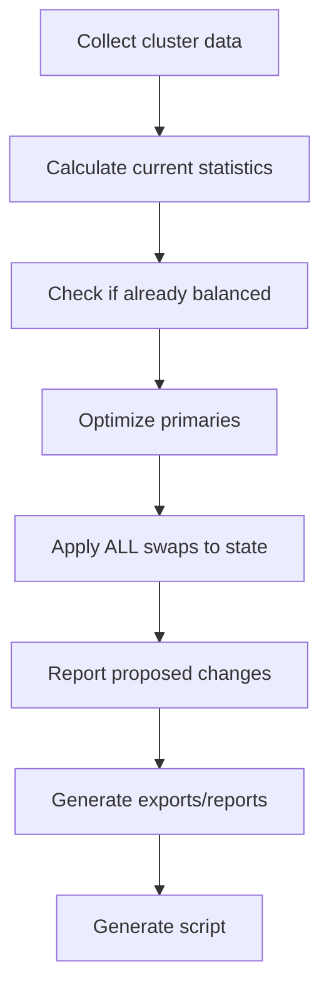

# Task 1.1: --max-changes CLI Option Implementation Design

**Version:** 1.0.0  
**Date:** 2026-02-03  
**Status:** Design Phase  
**Priority:** HIGH

---

## Overview

Implement the `--max-changes` CLI option to limit the number of primary reassignments applied. This is a critical production safety feature that allows operators to:
- Test changes incrementally
- Limit cluster impact during rebalancing
- Control the scope of operations for risk management

---

## Requirements

Based on [`plans/phase4-implementation-tasks.md`](phase4-implementation-tasks.md:34-55):

1. **Accept an integer argument** to limit the number of swap proposals
2. **Apply the limit after optimization** but before script generation
3. **Print a message** showing how many swaps were found vs. how many will be applied
4. **Recalculate the proposed state statistics** with the limited swap set

---

## Current Code Analysis

### Relevant Files
- [`src/ceph_primary_balancer/cli.py`](../src/ceph_primary_balancer/cli.py) - Main CLI entry point
- [`src/ceph_primary_balancer/optimizer.py`](../src/ceph_primary_balancer/optimizer.py:139) - Contains `apply_swap()` function
- [`src/ceph_primary_balancer/analyzer.py`](../src/ceph_primary_balancer/analyzer.py) - Statistical calculations

### Current Workflow (lines 113-322)



### Key Challenge

The [`optimizer.optimize_primaries()`](../src/ceph_primary_balancer/optimizer.py:268) function **modifies the state in-place** as it finds swaps. By line 205, when optimization completes:
- The `swaps` list contains all swap proposals
- The `state` object has been modified to reflect ALL swaps already applied

This means we cannot simply truncate the swaps list - we must:
1. Restore the state to post-optimization but **before** any swaps
2. Apply only the limited number of swaps
3. Recalculate statistics on the correctly limited state

---

## Implementation Strategy

### Option A: Store Original State and Re-apply Limited Swaps (RECOMMENDED)

**Pros:**
- Clean separation of concerns
- Accurate statistics for limited swap set
- Minimal changes to optimizer
- Easy to test and verify

**Cons:**
- Requires making a deep copy of state before optimization
- Need to re-apply swaps (but only limited set)

**Code Location:** [`cli.py`](../src/ceph_primary_balancer/cli.py) lines 200-210

```python
# Before optimization (around line 203)
original_state = copy.deepcopy(state)

# After optimization (around line 205)
swaps = optimizer.optimize_primaries(state, args.target_cv, scorer=scorer, pool_filter=args.pool)

# NEW: Apply max-changes limit
if args.max_changes and len(swaps) > args.max_changes:
    print(f"\n{'='*60}")
    print(f"APPLYING SWAP LIMIT")
    print(f"{'='*60}")
    print(f"Found {len(swaps)} optimal swaps")
    print(f"Limiting to {args.max_changes} changes (--max-changes)")
    print()
    
    # Truncate swap list
    swaps = swaps[:args.max_changes]
    
    # Restore state and re-apply limited swaps
    state = copy.deepcopy(original_state)
    for swap in swaps:
        optimizer.apply_swap(state, swap)
```

### Option B: Modify Optimizer to Accept Max Swaps

**Pros:**
- Optimizer stops early, more efficient
- No need to recompute state

**Cons:**
- Breaks optimizer's "find optimal solution" contract
- Optimization may not be as good (stops before finding best swaps)
- More invasive change

**Decision:** Use Option A (cleaner, more maintainable)

---

## Detailed Implementation Plan

### Step 1: Add CLI Argument

**File:** [`src/ceph_primary_balancer/cli.py`](../src/ceph_primary_balancer/cli.py:95-96)  
**Location:** After line 95 (after `--format` argument)

```python
parser.add_argument(
    '--max-changes',
    type=int,
    default=None,
    help='Maximum number of primary reassignments to apply (default: unlimited). '
         'Useful for testing or limiting cluster impact.'
)
```

**Validation:** Add after line 108 (after weight validation):
```python
# Validate max-changes
if args.max_changes is not None and args.max_changes < 0:
    print("Error: --max-changes must be non-negative")
    sys.exit(1)
```

### Step 2: Implement Swap Limiting Logic

**File:** [`src/ceph_primary_balancer/cli.py`](../src/ceph_primary_balancer/cli.py:207-212)  
**Location:** After line 207 (after `if not swaps:` block)

```python
# Step 6.5: Apply max-changes limit if specified
if args.max_changes and len(swaps) > args.max_changes:
    print("\n" + "="*60)
    print("APPLYING SWAP LIMIT")
    print("="*60)
    print(f"Optimization found {len(swaps)} beneficial swaps")
    print(f"Limiting to {args.max_changes} changes (--max-changes={args.max_changes})")
    print()
    
    # Truncate swap list to specified maximum
    swaps = swaps[:args.max_changes]
    
    # Restore state to pre-optimization and re-apply only limited swaps
    print(f"Recalculating proposed state with {len(swaps)} swaps...")
    state = copy.deepcopy(original_state)
    
    # Re-apply the limited set of swaps
    for swap in swaps:
        optimizer.apply_swap(state, swap)
    
    print(f"Proposed state recalculated with {len(swaps)} swaps")
```

**Note:** The `original_state` variable already exists at line 203, so we can use it.

### Step 3: Update Reporting Sections

**No changes needed!** All reporting sections (lines 213-311) already use:
- `len(swaps)` for swap count
- `state` for statistics calculations

Since we've:
1. Truncated the `swaps` list
2. Recalculated `state` with only those swaps

All existing reporting will automatically reflect the limited set.

### Step 4: Verification Points

The implementation will be correct if:
1. ✅ When `--max-changes N` is specified and optimizer finds > N swaps, exactly N swaps are in the final list
2. ✅ The `state` object reflects only those N swaps applied
3. ✅ All statistics (OSD, host, pool) are calculated from the state with N swaps
4. ✅ The generated script contains exactly N swap commands
5. ✅ When `--max-changes` is not specified, behavior is unchanged

---

## Testing Strategy

### Manual Testing

```bash
# Test 1: No limit (baseline)
./src/ceph_primary_balancer/cli.py

# Test 2: Limit to 10 changes
./src/ceph_primary_balancer/cli.py --max-changes 10

# Test 3: Limit larger than available swaps
./src/ceph_primary_balancer/cli.py --max-changes 10000

# Test 4: Limit to 0 (edge case)
./src/ceph_primary_balancer/cli.py --max-changes 0

# Test 5: Combined with other options
./src/ceph_primary_balancer/cli.py --max-changes 50 --pool 3 --dry-run
```

### Automated Test Case

**File:** `tests/test_max_changes.py` (new file)

```python
"""Test --max-changes CLI option functionality."""

import copy
from src.ceph_primary_balancer import optimizer, analyzer
from src.ceph_primary_balancer.models import ClusterState
from src.ceph_primary_balancer.scorer import Scorer

def test_max_changes_limits_swaps():
    """Test that max-changes correctly limits swap count."""
    # Create test cluster state
    state = create_test_cluster()
    original_state = copy.deepcopy(state)
    scorer = Scorer(w_osd=0.5, w_host=0.3, w_pool=0.2)
    
    # Find all optimal swaps
    all_swaps = optimizer.optimize_primaries(state, target_cv=0.10, scorer=scorer)
    
    # Apply max-changes limit
    max_changes = 10
    if len(all_swaps) > max_changes:
        limited_swaps = all_swaps[:max_changes]
        
        # Restore and re-apply limited swaps
        state = copy.deepcopy(original_state)
        for swap in limited_swaps:
            optimizer.apply_swap(state, swap)
        
        # Verify
        assert len(limited_swaps) == max_changes
        
        # Verify state reflects only limited swaps
        stats = analyzer.calculate_statistics(
            [osd.primary_count for osd in state.osds.values()]
        )
        # Stats should be worse than full optimization but better than original
        assert stats.cv > original_stats.cv  # Not as good as full optimization
        assert stats.cv < all_swaps_stats.cv  # Better than no changes
```

### Integration Test Update

**File:** `tests/test_integration.py`

Add test case:
```python
def test_cli_max_changes_option(tmp_path):
    """Test --max-changes CLI option."""
    output = tmp_path / "rebalance.sh"
    
    result = subprocess.run(
        ['python', '-m', 'src.ceph_primary_balancer.cli',
         '--max-changes', '5',
         '--output', str(output)],
        capture_output=True,
        text=True
    )
    
    # Verify output mentions limiting
    assert 'Limiting to 5 changes' in result.stdout
    
    # Verify script has exactly 5 commands
    with open(output) as f:
        script = f.read()
        swap_count = script.count('ceph osd pg-upmap-items')
        assert swap_count == 5
```

---

## Edge Cases

### Edge Case 1: max-changes = 0
**Behavior:** Apply zero swaps, report current state as "proposed" state (no changes)
**Handling:** Check should be `if args.max_changes is not None and len(swaps) > args.max_changes`

### Edge Case 2: max-changes > available swaps
**Behavior:** Apply all available swaps (no limiting needed)
**Handling:** The `if len(swaps) > args.max_changes` condition handles this naturally

### Edge Case 3: max-changes with --dry-run
**Behavior:** Show limited analysis, but don't generate script (as expected)
**Handling:** No special handling needed - dry-run check happens after limiting

### Edge Case 4: max-changes with --pool filter
**Behavior:** Limit applies to swaps within the filtered pool
**Handling:** Works naturally since pool filter affects swap list before limiting

### Edge Case 5: max-changes < 0 (invalid)
**Behavior:** Exit with error message
**Handling:** Add validation in Step 1

---

## Code Changes Summary

| File | Lines Changed | Type |
|------|---------------|------|
| [`cli.py`](../src/ceph_primary_balancer/cli.py) | +35 | Argument + Logic |
| `test_max_changes.py` | +60 | New Test File |
| `test_integration.py` | +15 | Test Case |
| **Total** | **~110 lines** | |

---

## Documentation Updates

### Update [`docs/USAGE.md`](../docs/USAGE.md)

Add section:
```markdown
### Limiting the Number of Changes

For production safety, you can limit the number of primary reassignments:

```bash
ceph-primary-balancer --max-changes 100
```

This is useful for:
- **Incremental testing**: Apply a small number of changes first
- **Risk management**: Limit the scope of operations
- **Gradual rebalancing**: Apply changes in batches over time

The tool will:
1. Find all optimal swaps through full optimization
2. Select the first N swaps (which are ordered by benefit)
3. Recalculate statistics based on only those N swaps
4. Generate a script with exactly N commands
```

### Update [`README.md`](../README.md)

Add to CLI options table:
```markdown
| `--max-changes N` | Limit to N primary reassignments | Safety feature for production |
```

---

## Timeline & Dependencies

- **Prerequisites:** None (can start immediately)
- **Dependencies:** Requires `copy.deepcopy()` (already imported in cli.py:13)
- **Blocks:** Task 1.2 (Health Checks), Task 1.3 (Rollback Scripts)

---

## Success Criteria

- [ ] CLI accepts `--max-changes` argument with integer value
- [ ] When specified, exactly that many swaps are applied
- [ ] Message clearly shows "found X swaps, limiting to Y"
- [ ] Proposed state statistics reflect only the limited swaps
- [ ] Generated script contains exactly the limited number of commands
- [ ] Works correctly with all other CLI options (--pool, --dry-run, etc.)
- [ ] Negative values are rejected with error message
- [ ] Zero value works (applies no swaps)
- [ ] When not specified, behavior is unchanged (unlimited)
- [ ] Tests pass for all edge cases
- [ ] Documentation updated

---

## Example Output

### Without --max-changes (current behavior)
```
OPTIMIZATION
============================================================
Target OSD CV: 10.00%
Scoring weights: OSD=0.5, Host=0.3, Pool=0.2

Iteration 0: OSD CV = 25.43%, Host CV = 18.21%, Avg Pool CV = 15.67%, Swaps = 0
...
Target OSD-level CV 10.00% achieved!

============================================================
PROPOSED STATE - OSD Level
============================================================
Proposed 247 primary reassignments
OSD CV Improvement: 25.43% -> 9.87%
```

### With --max-changes 50 (new behavior)
```
OPTIMIZATION
============================================================
Target OSD CV: 10.00%
Scoring weights: OSD=0.5, Host=0.3, Pool=0.2

Iteration 0: OSD CV = 25.43%, Host CV = 18.21%, Avg Pool CV = 15.67%, Swaps = 0
...
Target OSD-level CV 10.00% achieved!

============================================================
APPLYING SWAP LIMIT
============================================================
Optimization found 247 beneficial swaps
Limiting to 50 changes (--max-changes=50)

Recalculating proposed state with 50 swaps...
Proposed state recalculated with 50 swaps

============================================================
PROPOSED STATE - OSD Level
============================================================
Proposed 50 primary reassignments
OSD CV Improvement: 25.43% -> 18.92%
```

Note how:
1. Optimization still runs fully (finds all 247 swaps)
2. Clear messaging about limiting
3. CV improvement is less (18.92% vs 9.87%) because fewer swaps applied
4. Proposed count reflects limited set

---

## Questions & Decisions

### Q1: Should we take the first N swaps or the "best" N swaps?

**Decision:** Take the first N swaps from the optimizer's list.

**Rationale:**
- The optimizer returns swaps in the order they were found
- Each iteration finds the single best swap at that moment
- Early swaps tend to have higher impact (greedy algorithm property)
- This is simpler and more predictable

### Q2: Should max-changes affect the optimization algorithm itself?

**Decision:** No, let optimization run fully, then limit.

**Rationale:**
- Cleaner separation of concerns
- Optimization can be validated independently
- User can see how many swaps were found vs applied
- Future enhancement could allow "resume optimization" use cases

### Q3: What order should swap limiting happen relative to exports?

**Decision:** Limit swaps before any reporting or exports.

**Rationale:**
- All outputs (terminal, JSON, markdown, script) should be consistent
- JSON export should reflect the actual proposed changes
- Reports should show accurate statistics for limited swap set

---

## Implementation Checklist

Based on this design document, the implementation steps are:

- [ ] Add `--max-changes` CLI argument with validation
- [ ] Implement swap limiting logic after optimization
- [ ] Add informational output section
- [ ] Test manually with various max-changes values
- [ ] Create unit test for swap limiting logic
- [ ] Add integration test for CLI option
- [ ] Update USAGE.md documentation
- [ ] Update README.md with new option
- [ ] Verify all edge cases work correctly
- [ ] Code review and merge

---

## References

- **Task Definition:** [`plans/phase4-implementation-tasks.md`](phase4-implementation-tasks.md:34-55) lines 34-55
- **CLI Module:** [`src/ceph_primary_balancer/cli.py`](../src/ceph_primary_balancer/cli.py)
- **Optimizer Module:** [`src/ceph_primary_balancer/optimizer.py`](../src/ceph_primary_balancer/optimizer.py)
- **Roadmap:** [`plans/IMPLEMENTATION-ROADMAP.md`](IMPLEMENTATION-ROADMAP.md)
